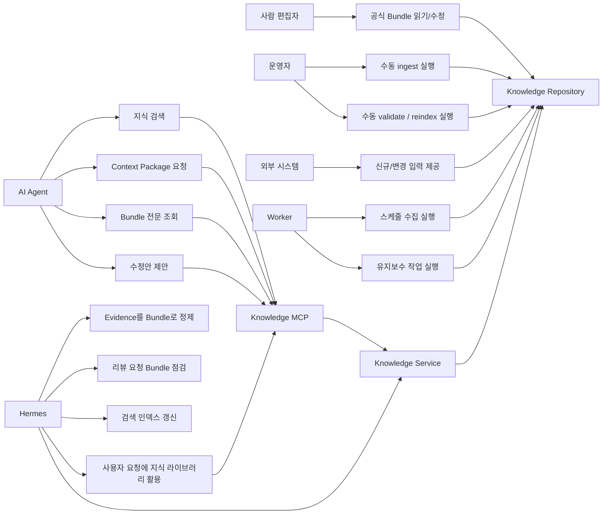
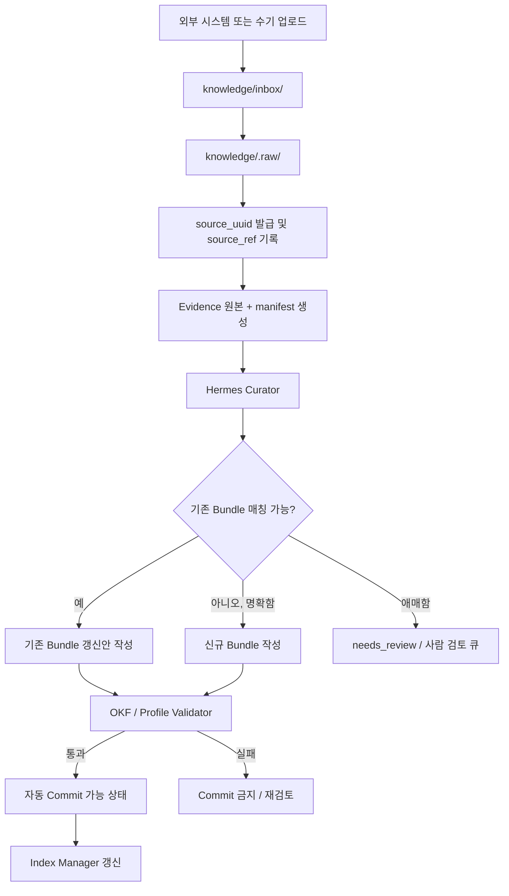
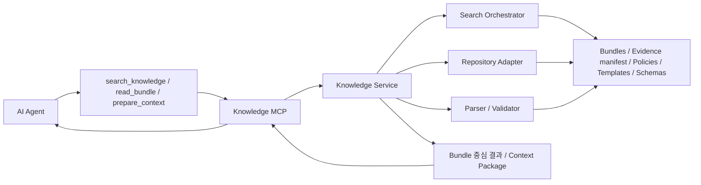
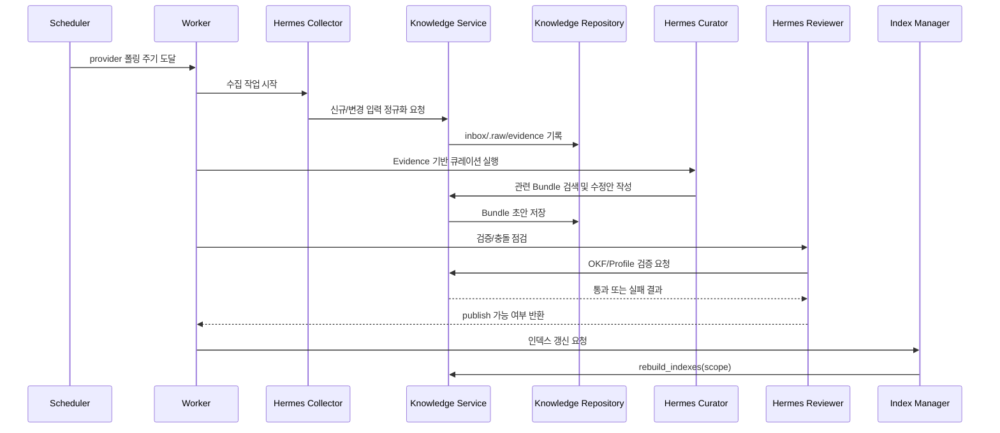
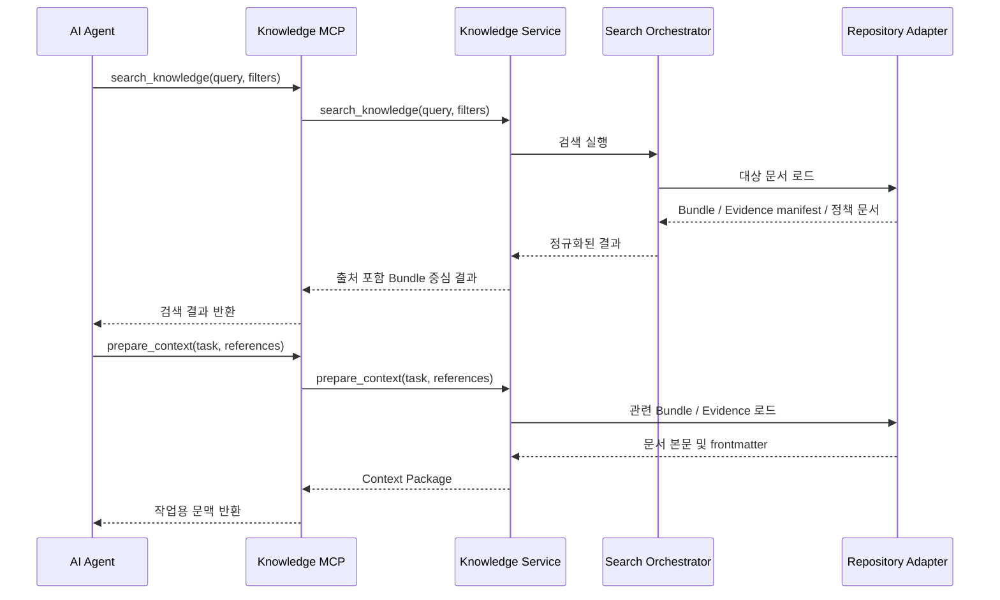
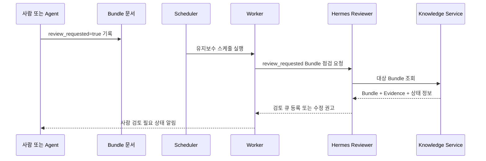
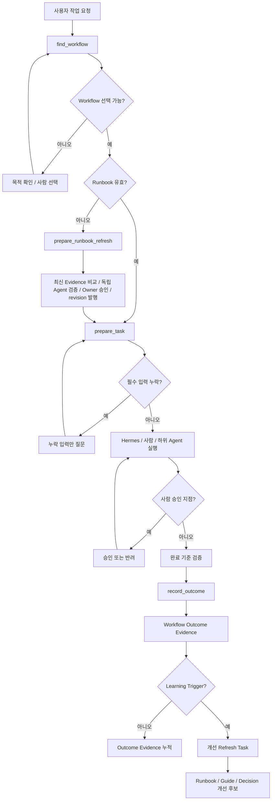

# 유즈케이스 및 플로우 다이어그램

## 1. 목적

이 문서는 `AI Knowledge Operating System`의 대표 유즈케이스와 핵심 운영 흐름을 Mermaid 다이어그램으로 정리한다.

아래 다이어그램은 `docs/02-architecture.md`, `docs/05-hermes-architecture.md`, `docs/06-knowledge-service.md`, `docs/07-mcp-spec.md`, `docs/08-sync-pipeline.md`, `docs/12-runtime-architecture.md`를 시각적으로 요약한 것이다.

## 2. 주요 액터

- 사람 편집자: Obsidian에서 공식 지식을 읽고 수정한다.
- 운영자: CLI 또는 관리 스크립트로 수동 실행과 점검을 수행한다.
- 외부 시스템: Notion, Slack, GitHub, Jira, Meetings 같은 입력 소스다.
- Worker: 스케줄, 수동 트리거, 유지보수 작업을 실행한다.
- Hermes: 회사 전용 지식 라이브러리의 운영자이자 이용자다. Collector, Curator, Reviewer, Index Manager, Delegator 역할로 외부 정보를 축적·정제하고, 사용자 요청 시 직접 라이브러리를 검색·활용하거나 다른 AI Agent가 MCP 또는 CLI로 이용하도록 한다.
- Knowledge Service: 저장소, 검색, 검증, Context Package 생성을 제공한다.
- Knowledge MCP: 외부 AI Agent용 인터페이스를 제공한다.
- AI Agent: Codex, Claude Code, Gemini 같은 소비자다.

## 3. 시스템 유즈케이스

## 4. 신규 지식 수집 유즈케이스

## 5. AI Agent 조회 유즈케이스

## 6. 운영 시퀀스: 스케줄 수집

## 7. 운영 시퀀스: Agent 조회

## 8. 운영 시퀀스: review_requested 처리

## 9. 해석 포인트

- MVP 기본 경로는 `스케줄 폴링 + 수동 트리거`다.
- 실시간 webhook과 파일 watcher는 현재 기본 경로가 아니다.
- Knowledge MCP는 직접 OS 명령을 고르지 않고 Knowledge Service를 호출한다.
- Bundle 생성/갱신은 항상 Evidence 기반이며, 검증 통과 전에는 publish되지 않는다.
- `review_requested`는 문서 나이와 무관한 정확성 의심 신호다.

## 10. Workflow 실행과 지식 환류

실행 중 상태는 `.runtime/tasks/`에 두고, 재사용 가치가 있는 결과만 Evidence와 Bundle 흐름으로
되돌린다. 상세 규칙은 [16-workflow-execution.md](16-workflow-execution.md)를 따른다.
