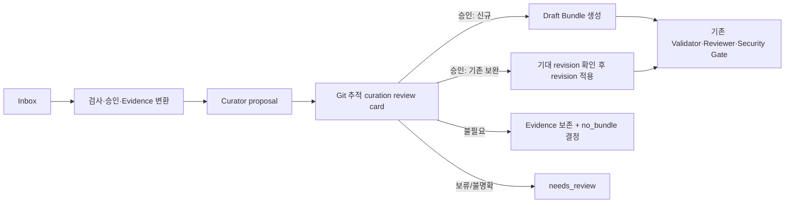

# Curation Review Queue 도입 작업 계획서

**상태:** In progress — 제품 Runtime의 검토카드·승인 Gate 구현 완료, 외부 adapter 배포와 리포트 전환 대기  
**목적:** 야간 자동화가 Evidence를 일괄 Bundle로 만드는 일을 막고, 사람이 검토하기 쉬운 단위의 후보 큐를 Git에서 관리한다.

## 1. 배경과 문제 정의

현재의 안전한 정제 흐름은 Evidence에서 `proposal`을 만들고 사람의 검토를 거쳐 Draft 생성 또는 기존 Bundle 갱신을
결정하는 구조다. 그러나 외부 야간 자동화가 `create_draft_bundle` 추천을 즉시 실행하거나 CLI 실패 시 Markdown/YAML을
직접 작성하면, Evidence 수만큼 Bundle이 생기고 공식 Runtime의 검증·역참조·revision Gate도 우회한다.

이번 변경은 다음을 보장한다.

1. 야간 배치는 Inbox 처리, Evidence 변환, 후보 분석, 검토큐 생성까지만 자동으로 수행한다.
2. Bundle 생성·기존 Bundle 갱신은 사용자의 명시적 검토 결정 뒤에만 실행한다.
3. Bundle이 불필요한 Evidence도 보존하며, 같은 checksum의 항목이 매일 다시 후보가 되지 않게 한다.
4. 검토 대상은 Evidence 한 건씩이 아니라 의미상 묶인 변경 제안 단위로 보여 준다.

## 2. 범위와 비범위

### 범위

- Git 추적 경로 `knowledge/curation-reviews/`와 검토 카드 형식 도입
- Evidence checksum, 대상 Bundle revision을 이용한 idempotency·stale 판정
- 후보 생성, 조회, 결정 기록, 승인된 변경 적용의 CLI/MCP 계약
- 외부 야간 adapter의 자동 생성 금지 및 오류 처리 계약
- 일일 리포트의 최종 상태 중심 지표화
- `no_bundle`, `archived` 결정을 보존하는 운영 흐름

### 비범위

- Evidence 원문 또는 restricted 정보를 검토큐에 복제
- Active Bundle 승격의 Owner·Security Gate 완화
- 운영 설치의 특정 경로, Agent 이름, 조직 ID, 외부 연동 식별자를 제품 기본값에 포함
- 기존 데이터의 일괄 삭제·이동

## 3. 목표 흐름



야간 배치는 `P -> Q`까지만 허용한다. `Q -> D`와 `Q -> R`은 인증된 사용자 또는 권한 있는 reviewer의 명시적
결정과 해당 mutation 명령으로만 수행한다. 직접 파일 쓰기 fallback은 허용하지 않는다.

## 4. 데이터 모델

### 4.1 검토 카드

카드는 `knowledge/curation-reviews/<YYYY-MM>/<review-id>.md`에 저장하고, 루트 `README.md`와 `index.md`는
사람 탐색용으로 둔다. 카드에는 원문을 복사하지 않고 Evidence ID·안전한 요약·결정에 필요한 참조만 둔다.

필수 메타데이터 초안:

```yaml
---
type: curation_review
status: pending # pending | approved | rejected | no_bundle | needs_changes | stale | applied | archived
title: "안전하게 정제된 후보 제목"
created_at: "<UTC timestamp>"
recommendation: create_draft_bundle # update_existing | no_bundle | needs_review
evidence_refs:
  - evidence_id: "<evidence-id>"
    path: "knowledge/evidence/<provider>/<evidence-file>.md"
    checksum: "sha256:<checksum>"
target_bundle_id: null
expected_knowledge_revision: null
extensions:
  curation_review:
    idempotency_key: "<stable digest>"
    generated_by: "<authenticated actor or runtime>"
---
```

- `evidence_refs.path`는 저장소 root 기준 canonical 상대 경로다. 실제 적용 명령은 이 경로로 Evidence를 읽고,
  `evidence_id`와 `checksum`까지 일치할 때만 사용한다. 절대 경로와 원문 복사본은 저장하지 않는다.
- `update_existing`은 `target_bundle_id`와 `expected_knowledge_revision`을 반드시 가진다.
- 카드의 제목·요약·차이는 PII와 credential을 다시 노출하지 않는 검증된 파생 정보만 사용한다.
- 동일한 Evidence checksum 집합, 추천 유형, 대상 Bundle·revision으로 계산한 `idempotency_key`가 이미 열려 있으면 새
  카드를 만들지 않는다.
- 대상 Evidence의 경로·ID·checksum 조합 또는 Bundle revision이 바뀌면 기존 카드를 `stale`로 전환하고 새 카드를 만든다.

### 4.2 Evidence 역참조

후보가 된 Evidence에는 기존 무결성 필드를 훼손하지 않고 `extensions.curation_review`를 기록한다.

```yaml
extensions:
  curation_review:
    review_id: "<review-id>"
    status: pending # approved | no_bundle | stale | applied
    evidence_checksum: "sha256:<checksum>"
    decided_at: null
```

이 연결은 자동 재등록 방지용이며, Bundle의 `evidence` 참조를 대체하지 않는다.

### 4.3 상태 전이

| 현재 상태 | 허용 결정 | 결과 |
| --- | --- | --- |
| `pending` | 승인, 수정 요청, 불필요, 보류 | `approved`, `needs_changes`, `no_bundle`, `needs_review` |
| `approved` | 적용 | Draft 생성 또는 revision 적용 후 `applied` |
| `pending`/`approved` | Evidence checksum·대상 revision 변경 | `stale` |
| `no_bundle` | 명시적 재검토 또는 원문 변경 | 새 `pending` 카드 |
| `applied`/`no_bundle`/`stale` | 보존 기간 경과 | `archived` |

`archived`는 폴더 이동이 아니라 상태와 사유·복구 조건으로 표현한다. `no_bundle`은 내용이 폐기됐다는 뜻이 아니라,
현재 기준으로 Bundle화하지 않는다는 결정이다. Evidence는 `knowledge/evidence/`에 계속 보존한다.

## 5. 구현 단계

### 현재 구현 상태 (2026-07-23)

- [x] `knowledge/curation-reviews/` 검토카드, Evidence ID·상대 경로·checksum, idempotency key와 상태 검증
- [x] 외부 Curator의 정상 응답을 Draft 대신 검토카드로 저장하도록 Runtime 전환
- [x] `list-curation-reviews`, `decide-curation-review` CLI/MCP 계약
- [x] reviewer 승인 후에만 신규 Draft를 생성하고, 생성 actor의 self-approval 차단
- [x] `no_bundle` 결정은 Evidence를 보존한 채 기록
- [x] 대상 Bundle revision 또는 Evidence checksum 불일치 시 `stale` 차단
- [ ] 실제 외부 야간 adapter에서 직접 파일 생성 fallback 제거 및 새 Runtime 배포
- [ ] 일일 리포트의 영속 상태 중심 지표 전환
- [ ] 여러 Evidence를 하나의 의미 단위 카드로 묶는 정책·UI

### Phase 0 — 안전 차단과 기준선

1. 운영 야간 adapter에서 `auto-create-bundles` 또는 이에 준하는 자동 Bundle 생성 호출을 제거·비활성화한다.
2. CLI 오류 시 YAML/Markdown 직접 작성 fallback을 제거한다. 오류는 재시도 가능한 `needs_review` 카드와 운영 이슈로
   남기며 Bundle·Evidence 링크를 임의로 수정하지 않는다.
3. 외부 adapter는 canonical Runtime의 release/checksum preflight를 통과할 때만 mutation을 허용한다.
4. 현재 누적된 Draft 후보와 이미 존재하는 Bundle을 read-only inventory로 분류한다. 이 단계에서 삭제·병합·재생성하지
   않는다.

**완료 조건:** 새 실행에서 Bundle 생성 수가 0이고, 후보 분석 결과만 재현 가능하게 남는다.

### Phase 1 — 스키마·Validator·저장소 경로

1. `curation_review`의 허용 필드, 상태, Evidence ID·상대 경로·checksum 조합, 날짜·revision 형식을 schema로 정의한다.
2. Validator가 `knowledge/curation-reviews/`를 관리 경로로 검사하고, 카드와 Evidence 역참조의 일관성을 검증한다.
3. `README.md`와 `index.md`는 예약 사용자 탐색 문서로 처리한다. 자동화는 날짜 하위 폴더의 index/README를 생성·수정하지 않는다.
4. 검토카드가 기본 검색, Operational Context, Graphify의 Active 지식에 섞이지 않도록 제외 규칙을 추가한다.

**완료 조건:** 잘못된 상태, 누락 checksum, PII가 포함된 파생 요약, 깨진 Evidence 참조, stale revision을 검증 단계에서
막을 수 있다. 검토 화면과 적용 명령 모두 카드의 상대 경로를 링크로 사용하되, ID·checksum 재확인을 거친다.

### Phase 2 — 후보 생성과 조회

1. Curator 결과를 `create_draft_bundle`, `update_existing`, `no_bundle`, `needs_review` 네 가지 의도로 구조화한다.
2. `create_draft_bundle`은 “자동 생성 명령”이 아니라 검토 추천값이다. 낮은 신뢰도, 중복·상충, 대상 불명확은
   기본적으로 `needs_review`가 된다.
3. `generate-curation-reviews`는 Evidence를 의미 단위로 묶어 카드 하나를 만들고 idempotency key로 중복 생성을 막는다.
4. `list-curation-reviews`는 기본적으로 `pending`, `needs_changes`, `needs_review`만 보여 주며, 날짜·추천·대상 Bundle·신뢰도로
   필터할 수 있게 한다.
5. 기존 Draft 후보와 열린 검토카드가 충돌하면 자동 병합하지 않고 관계를 표시한다.

**완료 조건:** 같은 입력으로 배치를 여러 번 실행해도 열린 카드 수와 Evidence 연결이 증가하지 않는다.

### Phase 3 — 사용자 결정과 적용

1. `decide-curation-review`는 인증된 actor, 결정 시각, 사유, 검토한 Evidence checksum을 기록한다. 생성 actor의
   self-approval은 허용하지 않는다.
2. 신규 후보의 승인만 `create_draft_bundle`을 호출한다. Draft 생성은 Active 발행이 아니며 기존 Owner·Security Gate를
   그대로 거친다.
3. 기존 Bundle 보완은 승인 시에도 `expected_knowledge_revision`이 현재와 같을 때만 `apply_bundle_revision`을 호출한다.
   다르면 `stale`로 전환한다.
4. `no_bundle`은 Evidence에 결정 역참조와 재검토 조건을 기록하고, 카드를 닫는다. Evidence를 archive 폴더로 이동하지 않는다.
5. 모든 적용은 Validator, Evidence 역참조 무결성, Publication Security Review를 통과해야 하며, 실패하면 카드와
   Evidence 결정을 원자적으로 이전 상태로 유지한다.

**완료 조건:** 승인 없는 신규 Draft/기존 Bundle 변경이 불가능하고, 적용 실패 후 고아 링크가 남지 않는다.

### Phase 4 — 야간 adapter·리포트·운영 전환

1. 외부 야간 adapter는 공식 CLI/MCP만 호출하고, `inspect -> accept -> ingest -> propose -> generate review` 순서를
   고정한다.
2. lock, lease, checkpoint, idempotency key, 부분 실패 재시도, dead-letter/`needs_review` 보존을 구현한다.
3. 일일 리포트는 아래의 영속 상태만 집계한다.

| 지표 | 의미 |
| --- | --- |
| 수집·Evidence 변환 | 실제 Inbox/Evidence 처리량 |
| 신규 검토카드 | 사람이 볼 새 후보 수 |
| 기존 Bundle 보완 후보 | revision 제안 수 |
| `no_bundle` | 결정 완료되어 재등록하지 않는 수 |
| `needs_review`/실패 | 운영자 조치 필요 수 |
| 승인 적용 | 실제 Draft 생성·revision 적용 수 |

리포트에서 “신규 Bundle”은 Draft가 실제로 생성된 뒤에만 증가시킨다. 임시 생성 후 삭제한 파일, proposal, review card는
Bundle 생성으로 세지 않는다.

**완료 조건:** 정상 야간 실행은 검토 요청만 만들고, 사용자의 승인 명령이 없는 한 Bundle 수·revision이 변하지 않는다.

## 6. 테스트와 수용 기준

다음은 제품 코드와 외부 adapter를 분리해 검증한다.

1. 후보 40개 입력을 여러 번 실행해도 Draft Bundle 0개, 동일 review card 1세트만 생성된다.
2. 신규 후보 승인 전후에만 Draft가 생성되며, Active로 승격되지 않는다.
3. 기존 Bundle 대상 카드가 revision 변경 뒤 승인되면 mutation 대신 `stale`가 된다.
4. `no_bundle` 결정 Evidence는 같은 checksum에서 재등록되지 않고, checksum 변경 또는 명시적 reopen 시에만 재검토된다.
5. CLI 강제 실패 시 직접 파일 작성 없이 `needs_review`/운영 이슈가 남고, Bundle·Evidence 무결성이 유지된다.
6. restricted/PII Evidence의 원문·민감 메타데이터가 review card, index, 리포트에 노출되지 않는다.
7. preflight failure, lock 충돌, 부분 실패 재실행에서 중복 카드·고아 링크·중복 revision이 생기지 않는다.
8. 기존 Validator, Evidence 양방향 참조, Owner·Security·Commit Gate 회귀 테스트를 통과한다.

## 7. 배포와 롤백

1. 원본 프로젝트에서 schema, runtime, CLI/MCP, validator, 테스트를 릴리스 단위로 검토한다.
2. 운영 설치에는 먼저 upgrade plan과 backup을 확인한 뒤 Control Plane만 올린다. `knowledge/`는 upgrade가 수정하지 않는다.
3. 첫 배치는 dry-run으로 카드 수, idempotency, report 수치를 확인한다.
4. 그 다음 자동화는 “검토큐 생성만” 활성화하고, 일정 기간 관찰 후에만 정기 실행으로 전환한다.
5. 이상 징후가 있으면 adapter의 mutation 권한을 비활성화하고 마지막 checkpoint부터 read-only 재현한다. 이미 생성된
   Evidence·Bundle은 삭제하지 않고 카드 상태와 운영 이슈로 복구 계획을 관리한다.

## 8. 착수 전 결정이 필요한 항목

1. reviewer 역할과 생성 actor 분리의 실제 인증 방식
2. `no_bundle` 재검토 기본 조건(원문 checksum 변경만 허용할지, 시간 기반 재검토도 둘지)
3. 카드 보존 기간과 `archived` 전환 주기
4. 의미 묶음의 최대 Evidence 수·신뢰도 임계값·대상 Bundle 매칭 기준
5. 외부 야간 adapter의 배포 위치와 운영자가 관리할 release pin 방식
6. 기존 Draft 후보를 유지·병합·폐기 중 어느 방식으로 일회성 정리할지에 대한 별도 승인

## 9. 의존성과 위험

- 외부 야간 adapter는 제품 저장소 밖에 있을 수 있으므로, 실제 수정에는 운영자의 adapter 소스·배포 권한이 필요하다.
- 운영 설치의 기존 문서·ID·checksum 검증 오류는 새 큐 도입과 별도로 복구해야 한다. 검증 오류가 남아 있으면 Draft/Revision
  적용·발행은 차단해야 한다.
- 검토카드는 Git 추적 대상이므로 최소 필요 정보만 담고, 원문·토큰·PII·restricted metadata를 넣지 않는다.
- 사용자 편의성을 위해 자동화를 넓히더라도, 추천·결정·변경·발행은 서로 다른 Gate로 유지한다.
