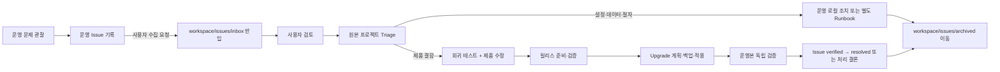

# AI Agent 역할 분리 및 운영 피드백 기반 제품 개선 체계 개편 계획서

**상태:** Proposed  
**작성일:** 2026-07-23  
**적용 대상:** Circled Wiki 원본 프로젝트, Bootstrap 배포 자산, 설치된 운영 Wiki의 Agent 지침  
**목적:** 제품 개발·릴리스·설치/업그레이드·운영·운영 이슈 환류의 책임과 권한을 분리하고, 운영에서 발견한 문제를 검증 가능한 제품 개선과 안전한 재배포로 연결한다.

## 1. 결론과 권고안

Circled Wiki의 AI Agent 지침을 다음 두 실행 컨텍스트로 분리한다.

1. **원본 프로젝트 Agent**
   - Circled Wiki 제품 코드, 스키마, 테스트, 배포 자산과 규범 문서를 개발한다.
   - 운영 이슈를 분류하고 제품 결함만 원본 개선 작업으로 승격한다.
   - 회귀 테스트, 릴리스 검증과 배포 계획을 담당한다.
   - 운영 저장소의 `knowledge/`, Inbox, Evidence, 설치 설정을 직접 운영하지 않는다.
2. **설치된 Runtime Agent**
   - 설치된 프로젝트의 지식 조회, Workflow 실행, Inbox/Evidence/Curation/Publication과 운영 관찰을 수행한다.
   - 제품 코드나 관리 Runtime을 직접 수정하지 않는다.
   - 문제를 운영 `workspace/issues/`에 안전하게 기록하고 검증된 릴리스의 upgrade만 적용한다.
   - `workspace/`에 Wiki별 작업, 자율형 Agent 기록과 사용자 백업을 둘 수 있지만 공식 지식으로 간주하지 않는다.

현재 루트 `AGENTS.md`를 원본 프로젝트용 Router로 바꾸고, 설치본에는 독립적인
`.circled-wiki/AGENT_ROUTER.md`를 배포한다. 루트 `agent-rules/` 전체를 설치본으로 복사하지 않고 Runtime 전용
Profile allowlist만 배포한다.

운영 피드백은 다음 수명주기를 따른다. 운영 프로젝트의 Issue는 사용자가 특정 프로젝트와 수집 범위를 명시적으로
지정했을 때만 `workspace/issues/inbox/`로 이동한다. 이동 대상은 Git에 추적·커밋된 파일이어야 하며, 이동에 실패하면
원래 위치에 남는다. 사용자와 검토하고 필요한 처리를 완료한 Issue는 `workspace/issues/archived/`로 이동한다.



## 2. 배경과 문제 정의

현재 설계에는 원본 프로젝트와 운영 저장소의 역할 구분이 존재한다.

- 원본 프로젝트는 Bootstrap, Runtime, CLI, MCP, 정책, 테스트와 배포 자산의 Source of Truth다.
- 운영 저장소는 설치별 설정, 지식, Evidence, Inbox, 운영 이슈와 실행 이력의 Source of Truth다.
- Runtime 수정은 원본에서 수행하고 운영본에는 검증된 upgrade로 배포한다.

이 모델은 다음 문서에 이미 정의되어 있다.

- `docs/23-operational-improvement-plan.md`
- `docs/26-adr-installed-runtime-distribution.md`

그러나 실제 Agent 지침은 아래 이유로 이 모델을 완전히 구현하지 못한다.

1. 루트 `AGENTS.md`의 기본 Router가 원본 제품 개발보다 Wiki 콘텐츠 운영 단계 중심이다.
2. `system-observation` Profile이 존재하지만 루트 Routing Table에는 없다.
3. 설치본 Startup 문서는 root `AGENTS.md`의 Routing Table을 요구하지만 Bootstrap이 생성하는 root `AGENTS.md`는 참조 전용 shim이다.
4. Bootstrap이 원본의 `agent-rules/` 전체를 설치본에 복사해 제품 개발용 Profile과 Runtime 운영용 Profile을 섞는다.
5. 운영 이슈를 제품 작업으로 분류·승격하고 릴리스·배포·독립 검증하는 규범 Profile이 없다.
6. 현재 테스트는 Router가 참조한 파일의 존재만 확인하고 필수 Profile 누락과 잘못된 배포 Profile을 검출하지 못한다.

이 상태를 유지하면 다음 실패가 발생할 수 있다.

- 원본 프로젝트 Agent가 제품 Maintainer 대신 Wiki 운영 Agent처럼 행동한다.
- 설치된 Runtime Agent가 `repository-engineering`을 선택해 관리 자산을 직접 수정하려 한다.
- 운영 오류가 기록되지 않거나 기록된 Issue가 제품 개선 작업으로 연결되지 않는다.
- 원본에서 수정한 코드와 설치 Runtime 사이의 release provenance가 끊긴다.
- upgrade 성공과 실제 문제 해결을 혼동해 Issue를 조기에 `resolved` 처리한다.

## 3. 목표와 비목표

### 3.1 목표

1. Agent가 현재 위치와 요청 목적만으로 원본 프로젝트와 설치본을 확실히 구분한다.
2. 각 실행 컨텍스트가 허용된 Profile만 볼 수 있게 한다.
3. 사용자가 지정한 운영 프로젝트의 Issue만 `workspace/issues/inbox/`에 수집하고 사용자 검토 Gate를 적용한다.
4. 운영 Issue와 제품 변경 사이에 명시적인 Triage·Release·Deployment handoff를 둔다.
5. 검토·처리가 끝난 Workspace Issue를 버전 정보와 함께 `workspace/issues/archived/`로 이동한다.
6. 설치본의 관리 자산은 직접 수정하지 않고 release upgrade로만 변경한다.
7. upgrade 완료와 문제 해결 검증을 분리한다.
8. 모든 Router·Profile·배포 자산 연결을 자동 테스트한다.
9. 기존 설치의 사용자 자료, `knowledge/`, 운영 `workspace/`, config와 Issue 기록을 보존한다.
10. 운영 `workspace/`를 manifest·upgrade·rollback이 소유하지 않는 사용자 Working Plane으로 보호한다.

### 3.2 비목표

- 운영 저장소의 Inbox, Evidence, Bundle을 원본 프로젝트로 자동 복사
- 운영 Issue 원문 또는 민감 로그의 자동·무승인 동기화
- 사용자 요청 없는 운영 Issue 이동·삭제
- Agent의 self-approval 허용
- Commit과 Push 권한의 자동 확대
- 기존 운영 Issue를 일괄 `resolved` 처리
- 이번 작업에서 Wiki의 지식 모델, OKF 스키마 또는 Curation 정책을 재설계
- 외부 Issue Tracker, CI/CD 서비스 또는 비밀 관리 시스템을 새로 도입

## 4. 용어와 실행 컨텍스트

| 용어 | 의미 |
| --- | --- |
| 원본 프로젝트 | Circled Wiki 제품 코드, 테스트, 규칙과 배포 자산을 개발하는 이 저장소 |
| 설치본 | 다른 프로젝트 root의 `.circled-wiki/` Control Plane, `knowledge/` Data Plane과 `workspace/` Working Plane |
| 운영 Workspace | 설치본 root의 `workspace/`. Wiki별 작업·Agent 기록·운영 Issue·사용자 백업을 두는 사용자 소유 영역 |
| Product Workspace | 원본 프로젝트의 `workspace/`. 제품 작업 계획·테스트와 반입한 Issue 검토 큐를 관리하는 개발 작업 영역 |
| Product Agent | 원본 프로젝트에서 제품 변경·릴리스·배포 계획을 수행하는 Agent |
| Runtime Agent | 설치본에서 Wiki 운영 기능을 수행하는 Agent |
| System Maintainer | 운영 Issue를 분류하고 제품 작업·운영 로컬 조치·보류로 결정할 권한이 있는 주체 |
| Release Verifier | 제품 수정과 배포 자산을 독립 검증하는 주체 |
| Deployment Operator | 승인된 release를 지정된 설치본에 계획·백업·적용하는 주체 |
| Operational Verifier | 실제 설치본에서 재현 시나리오와 preflight를 검증하는 구현자와 다른 주체 |
| Workspace Issue Item | 사용자가 지정한 Git 추적 운영 Issue를 `workspace/issues/inbox/`로 이동한 현재 작업 항목 |
| Issue Handoff | 민감정보를 제외한 Issue ID, 분류, 재현 조건, 기대 결과와 영향 범위를 원본 작업에 연결하는 참조 |

## 5. 목표 역할 및 책임 모델

### 5.1 역할별 RACI

| 단계 | Responsible | Accountable | Consulted | Informed |
| --- | --- | --- | --- | --- |
| 운영 문제 관찰·기록 | Runtime Agent 또는 사용자 | 운영 Operator | Data Owner | System Maintainer |
| 운영 Issue 수집 | Product Agent | 수집을 요청한 사용자 | 운영 Operator | System Maintainer |
| Workspace Issue 검토 | 사용자와 System Maintainer | 수집을 요청한 사용자 | 운영 Reporter | Product Owner |
| Issue Triage | System Maintainer | Product Owner | 운영 Reporter | Release Verifier |
| 제품 수정 | Repository Agent | 변경 요청 사용자 또는 Product Owner | System Maintainer | Deployment Operator |
| 릴리스 준비 | Release Agent | Product Owner | Repository Agent, Security Reviewer | 운영 Operator |
| 설치·upgrade | Deployment Operator | 대상 폴더 사용자 | System Maintainer | Knowledge Owner |
| 운영본 검증 | Operational Verifier | 운영 Owner | Reporter, Deployment Operator | Product Owner |
| Issue 종료 | System Maintainer | 운영 Owner | Operational Verifier | Reporter |
| Workspace Issue Archive | Product Agent | 검토 사용자 | System Maintainer | 운영 Reporter |

같은 실행 주체가 여러 역할을 맡을 수는 있지만 다음 분리는 유지한다.

- Issue Reporter와 원인 확정자는 동일할 필요가 없다.
- 제품 구현자와 Release Verifier를 분리한다.
- 제품 구현자 또는 Deployment Operator가 자신의 변경을 운영 환경에서 독립 검증한 것으로 기록할 수 없다.
- Agent는 사람 승인자를 대신하거나 actor 문자열만으로 권한을 주장하지 않는다.

### 5.2 변경 대상별 권한

| 대상 | 원본 프로젝트 Agent | 설치된 Runtime Agent | Deployment Operator |
| --- | --- | --- | --- |
| `src/`, 제품 테스트 | 변경 가능 | 변경 금지 | 변경 금지 |
| 제품 규칙·배포 Template | 변경 가능 | 직접 변경 금지 | 검증된 release 적용만 |
| 설치 `.circled-wiki/runtime/` | 직접 변경 금지 | 직접 변경 금지 | Bootstrap upgrade만 |
| 설치 `.circled-wiki/config.yaml` | 조직 중립 schema/default만 | 승인된 설정 작업만 | upgrade에서 보존 |
| 설치 `knowledge/` | fixture 외 변경 금지 | Profile·Gate에 따라 운영 | upgrade에서 변경 금지 |
| 설치 `workspace/` | 제품 fixture 외 변경 금지 | 요청·운영 절차에 따라 사용 | install 후 변경 금지 |
| 설치 `workspace/issues/` | 명시적 사용자 요청으로 원본 Workspace 이동 | 생성·허용된 상태 기록 | 배포·검증 receipt 기록 |
| legacy 설치 `.circled-wiki/issues/` | 사용자 승인 migration 전 read-only | 신규 기록 금지 | upgrade에서 변경 금지 |
| 원본 `workspace/issues/inbox/` | 명시적 사용자 요청으로 이동된 Issue 관리 | 접근 금지 | 접근 금지 |
| 원본 `workspace/issues/archived/` | 검토·처리 Gate 후 Issue 버전 보존 | 접근 금지 | 접근 금지 |
| Git Commit/Push | 승인 Scope와 Gate 적용 | Publication 경계만 | 배포 자체로 자동 Push 금지 |

## 6. 목표 지침 및 디렉터리 구조

### 6.1 원본 프로젝트

```text
AGENTS.md
PRODUCT_ENGINEERING_RULES.md
product-agent-rules/
├── README.md
├── operational-issue-intake.md
├── repository-engineering.md
├── system-issue-triage.md
├── release-preparation.md
├── deployment-coordination.md
└── bootstrap-circled-wiki.md
```

- 루트 `AGENTS.md`는 원본 프로젝트용 Router다.
- `PRODUCT_ENGINEERING_RULES.md`는 제품 개발, 릴리스, 배포와 운영 피드백 처리의 전역 불변식이다.
- `product-agent-rules/`는 원본 프로젝트에서만 사용하고 설치본에 배포하지 않는다.
- 제품 코드 또는 규범 문서 변경 요청은 기본적으로 `repository-engineering`으로 라우팅한다.
- 사용자가 특정 운영 프로젝트의 Issue 수집을 요청하면 `operational-issue-intake`로 Git 추적 Issue를
  `workspace/issues/inbox/`로 이동한다.
- 운영 Issue가 입력이면 사용자 검토 후 반드시 `system-issue-triage`를 거친다.

Workspace 작업 영역은 다음과 같이 관리한다.

```text
workspace/
└── issue/
    ├── README.md
    ├── inbox/
    │   └── <project-ref>/
    │       └── <source-issue-id>.md
    └── archived/
        └── YYYY/
            └── MM/
                └── YYYYMMDDTHHMMSSZ-<canonical-issue-key>-vNNNN.md
```

- 운영 Issue는 Git에 추적·커밋된 경우에만 이동한다.
- 사용자가 대상 프로젝트와 Issue를 명시적으로 지정해야 한다.
- `inbox/`에는 검토 중인 Workspace Issue Item만 둔다.
- 검토·처리 완료 뒤 같은 파일을 보관 월의 `archived/YYYY/MM/`에 이동하고 Inbox에는 복사본을 남기지 않는다.
  파일명과 Frontmatter의 occurrence가 같은 canonical Issue의 발생 순서를 보존한다.
- `project-ref`는 조직명이나 머신 절대 경로가 아닌 사용자가 확인한 안전한 별칭이다.
- Archive 이동은 Workspace 작업 항목에만 적용한다. Bundle·Evidence의 `status: archived` 규칙과 혼동하지 않는다.
- 이동 전 상태와 과거 내용은 Git 이력으로 복구한다.

### 6.2 Runtime 배포 원본

```text
OPERATING_RULES.md
agent-rules/
├── README.md
├── knowledge-query.md
├── workflow-execution.md
├── inbox-capture.md
├── inbox-inspection.md
├── evidence-ingest.md
├── knowledge-curation.md
├── publication.md
├── system-observation.md
└── runtime-upgrade-verification.md

.circled-wiki/
├── AGENT_ROUTER.md
├── AGENT_BOOTSTRAP.md
└── AUTONOMOUS_AGENT_STARTUP.md
```

- 기존 `OPERATING_RULES.md`와 `agent-rules/`는 Runtime 운영 규약의 배포 원본으로 유지한다.
- `repository-engineering`과 `bootstrap-circled-wiki`는 `product-agent-rules/`로 이동한다.
- 설치본은 `.circled-wiki/AGENT_ROUTER.md`를 명시적 Router로 사용한다.
- 설치본 root의 `AGENTS.md`, `CLAUDE.md`, `HERMES.md`는 Router가 아니라 참조 전용 shim으로 유지한다.
- Startup 문서가 root shim에 Routing Table이 있다고 가정하지 않게 한다.

### 6.2.1 루트 Agent 규칙 참조 블록 계약

설치본 root의 `AGENTS.md`, `CLAUDE.md`, `HERMES.md`는 조직이 소유하는 진입점이다. Bootstrap은 이 파일에 Runtime
운영 규칙 전체를 복사하거나 기존 조직 규칙을 재작성하지 않는다. Wiki 운영 규칙은 항상 `.circled-wiki/` 아래의 관리
자산을 canonical source로 사용한다.

Bootstrap은 각 파일에 Circled Wiki 참조가 없을 때만 다음과 같은 표시된 참조 블록을 append한다.

```md
<!-- circled-wiki:agent-bootstrap -->

Wiki 운영 요청은 `.circled-wiki/AGENT_BOOTSTRAP.md`,
`.circled-wiki/AGENT_ROUTER.md`, `.circled-wiki/OPERATING_RULES.md`를 먼저 읽고 따른다.
```

처리 규칙:

1. 새 설치에서 root Agent 파일이 없으면 참조 블록만 포함한 최소 진입점 파일을 생성한다.
2. 기존 파일에 참조 블록이나 `.circled-wiki/OPERATING_RULES.md` 참조가 없으면 기존 본문을 보존한 채 끝에 한 번만 append한다.
3. 이미 참조가 있으면 그대로 보존한다. 같은 블록을 중복 추가하지 않는다.
4. upgrade는 root Agent 파일을 덮어쓰거나 release manifest의 관리 자산으로 등록하지 않는다.
5. Runtime 규칙 변경은 `.circled-wiki/`의 release 자산만 갱신한다. root shim은 새 release에 맞게 다시 작성하지 않는다.
6. 조직 고유 규칙과 Runtime 규칙이 충돌하면 Wiki 운영 행위에는 `.circled-wiki/OPERATING_RULES.md`의 보안·승인·Data Plane
   불변식이 우선한다. 충돌을 자동 병합하거나 조직 규칙을 삭제하지 않는다.
7. 참조 블록 자체를 추가할 수 없는 파일 형식·조직 정책이면 원본을 변경하지 않고 `preserve_and_propose` 결과와 수동 연결
   방법을 보고한다.

이 블록은 Runtime 권한을 넓히지 않는다. Agent가 규칙의 위치와 Router를 발견하게 하는 역할만 한다.

### 6.3 Bootstrap 패키징 원칙

Bootstrap은 디렉터리 전체 복사 대신 다음 명시적 allowlist를 사용한다.

```text
OPERATING_RULES.md
agent-rules/README.md
agent-rules/knowledge-query.md
agent-rules/workflow-execution.md
agent-rules/inbox-capture.md
agent-rules/inbox-inspection.md
agent-rules/evidence-ingest.md
agent-rules/knowledge-curation.md
agent-rules/publication.md
agent-rules/system-observation.md
agent-rules/runtime-upgrade-verification.md
.circled-wiki/AGENT_ROUTER.md
.circled-wiki/AGENT_BOOTSTRAP.md
.circled-wiki/AUTONOMOUS_AGENT_STARTUP.md
```

새 Runtime Profile을 배포하려면 다음 세 가지를 같은 변경에서 수행한다.

1. allowlist 추가
2. Runtime Router 추가
3. 패키징·설치 회귀 테스트 추가

파일이 디렉터리에 존재한다는 이유만으로 자동 배포하지 않는다.

### 6.4 설치본 `workspace/` Working Plane 계약

설치본 root의 `workspace/`는 `knowledge/`와 마찬가지로 `.circled-wiki/` Control Plane 밖에 둔다.

```text
<operating-wiki-root>/
├── .circled-wiki/       # OS가 release upgrade로 관리
├── knowledge/           # 공식 지식 Data Plane
└── workspace/           # 설치별 Working Plane
    ├── issues/           # 운영 중 발견한 시스템 Issue
    ├── tasks/            # Wiki별 임시·장기 작업 상태
    ├── agents/           # 자율형 Agent의 안전한 기록·checkpoint
    └── backups/          # 사용자가 관리하는 자료·작업 백업
```

하위 폴더는 권장 관례이며 설치별 필요에 따라 다르게 구성할 수 있다. Circled Wiki는 폴더 이름이나 내부 schema를
일괄 강제하지 않는다. 단, Runtime 기능이 공식적으로 사용하는 하위 경로는 별도 Profile과 schema를 먼저 정의한다.

용도:

- 해당 Wiki에만 필요한 작업 계획·결정 대기·처리 상태
- 자율형 Agent의 checkpoint, 실행 요약, 복구용 기록
- 운영 Issue와 처리 전후의 안전한 작업 자료
- 사용자가 보관하는 설정 외 자료와 작업 백업
- 공식 Bundle로 승격하기 전의 비공식 참고 산출물

경계:

- `workspace/`의 내용은 공식 Knowledge Bundle 또는 Evidence가 아니다.
- Knowledge Query, 기본 검색, Graphify와 Curation은 명시적 Inbox 수집 전까지 `workspace/`를 읽거나 인덱싱하지 않는다.
- credential, token, password 또는 무제한 원문 로그를 저장하는 기본 위치로 사용하지 않는다.
- Agent 기록은 목적, 보존기간과 민감성 정책을 가져야 한다.
- `workspace/backups/`는 사용자·Agent 작업 자료의 백업이다. `.circled-wiki/` upgrade 직전 Control Plane backup인
  `.circled-wiki-backups/`를 대체하지 않는다.

소유권:

1. 신규 설치는 `workspace/`가 없을 때 root 폴더만 생성한다.
2. 생성된 순간부터 전체 `workspace/`는 설치 사용자 소유다.
3. Bootstrap manifest에 `workspace/` 내부 파일이나 폴더를 관리 자산으로 등록하지 않는다.
4. 신규 설치가 권장 하위 폴더나 안내 문서를 만들더라도 사용자 관리 자산으로 즉시 인계하고 이후 release checksum에서 제외한다.
5. 기존 설치에 `workspace/`가 없으면 일반 upgrade가 자동 생성하지 않는다. 별도의 사용자 승인
   `initialize-operational-workspace` 작업으로 한 번만 생성한다.

보호 규칙:

- upgrade는 `workspace/`를 탐색해 소유권을 추론하지 않는다.
- upgrade·rollback은 `workspace/` 내부 파일·폴더를 생성·수정·이동·이름 변경·삭제하지 않는다.
- `.circled-wiki-backups/`에 `workspace/`를 포함하지 않는다.
- Runtime release 제거·복원도 `workspace/`를 정리하지 않는다.
- upgrade 계획의 action 대상에 `workspace/` 경로가 하나라도 있으면 적용을 차단한다.
- 격리된 upgrade 테스트에서는 `workspace/` sentinel과 파일 tree가 전후 동일한지 확인한다.

Git 추적, 보존기간과 backup 정책은 설치별로 결정한다. 동일 `workspace/` 안에서도 Issue처럼 Git 복구가 필요한 자료와
Agent cache처럼 비추적이어야 하는 자료를 구분할 수 있다.

## 7. 목표 Router

### 7.1 원본 프로젝트 Router

| 요청 또는 입력 상태 | 필수 Product Profile |
| --- | --- |
| 코드·스키마·테스트·제품 문서 변경 | `repository-engineering` |
| 사용자가 지정한 운영 프로젝트에서 Issue 수집 | `operational-issue-intake` |
| 운영 Issue 신규 유입·분류·재현 가능성 평가 | `system-issue-triage` |
| 릴리스 후보 생성·manifest·호환성·회귀 검증 | `release-preparation` |
| 지정 설치본에 install·upgrade·rollback 계획 | `deployment-coordination` |
| 신규 설치·기존 Control Plane upgrade 실행 | `bootstrap-circled-wiki` |
| 기존 설치에 사용자 Working Plane 최초 초기화 | `bootstrap-circled-wiki`의 승인된 `initialize-operational-workspace` 경로 |

추가 규칙:

- 운영 프로젝트 Issue 수집은
  `operational-issue-intake -> 사용자 검토 -> system-issue-triage` 순서로 처리한다.
- 운영 Issue가 입력인 제품 변경은
  `operational-issue-intake -> 사용자 검토 -> system-issue-triage -> repository-engineering` 순서로만 전환한다.
- 사용자 검토 없이 Inbox Issue를 코드 변경, 릴리스 또는 Archive로 전환하지 않는다.
- 코드 변경 완료만으로 `release-preparation`을 자동 시작하지 않는다.
- release 검증 완료만으로 운영본 upgrade를 자동 실행하지 않는다.
- 설치 경로와 apply 의도가 명확하지 않으면 배포를 시작하지 않는다.

### 7.2 설치된 Runtime Router

| 요청 또는 현재 상태 | 필수 Runtime Profile |
| --- | --- |
| 지식 조회·질문 답변 | `knowledge-query` |
| 사용자 업무 Runbook 실행 | `workflow-execution` |
| 대화·파일을 Inbox에 수집 | `inbox-capture` |
| Inbox 검사·민감성 검토·승인 | `inbox-inspection` |
| 승인된 Inbox를 Evidence로 변환 | `evidence-ingest` |
| Evidence 정제·Bundle 후보 생성 | `knowledge-curation` |
| 검토·발행·Commit | `publication` |
| 오류·비정상 결과·반복 수작업·개선 요청 기록 | `system-observation` |
| upgrade 후 preflight·validate·재현 시나리오 확인 | `runtime-upgrade-verification` |

추가 규칙:

- Runtime Agent는 `repository-engineering`을 선택할 수 없다.
- CLI, Validator 또는 preflight 실패가 발생하면 기존 작업의 실패 처리를 먼저 수행하고 `system-observation`으로 전환한다.
- `system-observation`은 Issue 기록까지만 담당하며 수정·upgrade 권한을 가져오지 않는다.
- upgrade는 Runtime Agent가 임의 시작하지 않고 승인된 release와 대상 Scope를 입력으로 받는다.

## 8. 운영 Issue에서 제품 개선까지의 계약

### 8.1 운영 프로젝트 Issue 수집 요청

수집은 사용자가 특정 운영 프로젝트와 범위를 명시적으로 요청했을 때만 시작한다.

필수 입력:

- 사용자가 지정한 운영 프로젝트 root 또는 이미 검증된 프로젝트 참조
- 저장할 안전한 `project-ref`
- 수집 범위: 명시적 Issue ID 목록, 상태 필터 또는 사용자가 승인한 전체 열린 Issue
- 수집 목적과 요청자
- 원본 접근 권한

이동 전 Gate:

1. 대상 root에 canonical `workspace/issues/` 또는 legacy `.circled-wiki/issues/`가 존재하는지 확인한다.
2. 대상이 Circled Wiki 설치본인지 manifest와 preflight의 read-only 정보로 확인한다.
3. 수집 범위가 불명확하면 전체 Issue를 추정해 가져오지 않는다.
4. 대상 Issue가 Git에 추적되고 커밋되어 있는지 확인한다.
5. 대상 Issue에 미커밋 변경이 있으면 이동하지 않고 먼저 사용자에게 알린다.
6. 목적지에 같은 이름의 미처리 Issue가 있으면 덮어쓰지 않는다.
7. Issue가 `system-observation`의 민감정보 제외 Gate를 통과한 기록인지 확인한다.

이동 동작:

1. Archive에서 동일 `canonical_issue_key` 또는 관련 Issue 후보를 찾는다.
2. 대상 파일을 `workspace/issues/inbox/<project-ref>/<source-issue-id>.md`로 `mv`한다.
3. 이동이 성공하면 Workspace Item을 `pending_review` 상태로 관리한다.
4. 이동이 실패하면 완료를 주장하지 않고 원래 경로에 파일이 남아 있는지 확인한다.
5. 과거 내용이 필요하면 운영 프로젝트의 Git 이력에서 복구한다.

별도의 copy 후 delete, Transfer Receipt 또는 원본 복사본은 만들지 않는다. Git 이력이 이동 전 원본과 복구 수단을
제공하고, 현재 파일은 Workspace Inbox가 관리한다.

### 8.2 Workspace Issue Item 계약

Workspace Issue Item은 최소 다음 정보를 가진다.

```yaml
---
type: workspace_issue
status: pending_review
workspace_issue_id: "<stable workspace id>"
source_project_ref: "<safe project alias>"
source_issue_id: "<operational issue id>"
source_release: "<observed release or unknown>"
source_git_revision: "<commit containing the issue>"
moved_at: "<UTC timestamp>"
moved_by: "<authenticated actor>"
requested_by: "<authenticated user>"
canonical_issue_key: "<stable issue family key or null>"
occurrence: 1
review:
  reviewed_by: null
  reviewed_at: null
  decision: null
processing:
  classification: null
  disposition: null
  history_relation: null
  similar_history: []
  linked_work: []
  linked_release: null
  linked_deployment_receipt: null
  linked_verification_receipt: null
archive:
  archived_at: null
  archived_by: null
  reason: null
  restore_condition: null
---
```

본문에는 다음 section을 둔다.

1. 안전하게 정리된 관찰 사실
2. 기대 결과
3. 실제 결과
4. 영향
5. 최소 재현 조건
6. 원인 가설
7. 사용자 검토 메모
8. 처리 결과와 후속 작업

이동된 Issue에는 기존 안전한 관찰 기록을 유지한다. Workspace 처리 과정에서도 고객 데이터, credential 또는 머신
절대 경로를 새로 추가하지 않는다.

### 8.3 사용자 검토와 처리

사용자 검토 전 상태는 `pending_review`다. Product Agent는 다음을 사용자와 확인한다.

- 실제로 검토할 Issue가 맞는지
- 사실·기대 결과·영향이 정확한지
- 민감정보가 제거됐는지
- Archive에서 발견한 유사 이력과 과거 해결 결과가 현재 Issue에 적용되는지
- 제품 결함, 설치 설정, 데이터 품질, 운영 절차 또는 외부 의존성 중 어떤 경로로 처리할지
- 중복, 보류, 처리 불필요 여부

#### 8.3.1 Archive 유사 이력 조회

모든 `pending_review` Issue는 사용자 검토 전에 `workspace/issues/archived/`의 기존 해결 이력을 조회한다. 정확히 같은
`canonical_issue_key`가 있으면 우선 표시하고, key가 없거나 달라도 다음 특성을 조합해 유사 후보를 찾는다.

- 영향 component와 `area`
- 오류 코드, 실패 단계와 명령
- 정규화한 기대 결과와 실제 결과
- 재현 시나리오 식별자
- 관련 schema·config·Runtime 영역
- 발생 release와 이전 `fixed_release`

조회 결과는 자동 판정이 아니라 사용자 검토 자료다. 각 후보에 다음을 표시한다.

| 항목 | 설명 |
| --- | --- |
| `archive_ref` | 기존 canonical Issue와 occurrence |
| `similarity_reasons` | 동일 component, 오류 코드, 실패 단계 등 일치 근거 |
| `differences` | release, 설정, 입력 또는 증상의 차이 |
| `previous_root_cause` | 과거에 검증된 원인 |
| `previous_resolution` | 적용한 코드·설정·절차 변경 |
| `previous_fixed_release` | 해결이 포함된 release |
| `previous_verification` | 배포 후 검증 결과 |
| `previous_regression_tests` | 기존 회귀 테스트 참조 |
| `recurrence_conditions` | 과거에 기록한 재발·복원 조건 |

사용자 또는 System Maintainer는 현재 Issue와 기존 이력의 관계를 다음 중 하나로 확정한다.

| 관계 | 의미 | 처리 |
| --- | --- | --- |
| `recurrence` | 해결 후 같은 원인·증상이 다시 발생 | 기존 canonical key의 다음 occurrence |
| `regression` | 과거 수정이 포함된 release에서 다시 실패 | 기존 수정과 회귀 테스트의 유효성 재검토 |
| `duplicate` | 같은 발생 건이 중복 보고됨 | canonical Issue에 연결하고 별도 수정하지 않음 |
| `related` | 일부 증상·영역은 같지만 원인 또는 범위가 다름 | 관련 이력으로 참조하되 별도 작업 가능 |
| `new` | 기존 해결 이력과 의미 있게 다름 | 새 canonical Issue 생성 |
| `undetermined` | 현재 근거로 관계를 확정할 수 없음 | 추가 정보가 올 때까지 Inbox 유지 |

과거 해결책이 존재하면 개선 작업은 처음부터 다시 추정하지 않고 다음을 확인한다.

1. 과거 `fixed_release`가 현재 운영 프로젝트에 실제 배포됐는가
2. 동일 회귀 테스트가 현재 release에서 통과하는가
3. 설정·schema·Runtime drift로 과거 수정이 무효화됐는가
4. 과거 수정이 증상만 완화하고 근본 원인을 남겼는가
5. 현재 발생이 같은 증상의 다른 원인인가

과거 해결책을 자동 재적용하지 않는다. 적용 범위와 현재 release를 비교하고, 기존 회귀 테스트를 재사용하되 현재 재발을
재현하는 새 실패 테스트를 추가한다. `processing.similar_history`에는 검토한 후보, 선택한 관계, 채택·배제 사유를
기록한다.

검토 결과:

| 결정 | Workspace 상태 | 다음 처리 |
| --- | --- | --- |
| 처리 승인 | `accepted` | `system-issue-triage` |
| 추가 정보 필요 | `needs_information` | Inbox 유지, 사용자 또는 운영 Reporter 확인 |
| 중복 | `duplicate` | canonical Workspace Issue 연결 후 Archive 가능 |
| 처리 불필요 | `rejected` | 사유와 재검토 조건 기록 후 Archive 가능 |
| 민감정보 문제 | `blocked` | Inbox 공유 중지, 제한된 검토 |

`accepted` 이후에는 Triage 결과에 따라 제품 수정, 운영 로컬 조치, Runbook 개선, 외부 의존성 대응 또는 보류를
수행한다. 각 처리 단계는 `processing.linked_work`와 관련 receipt를 Workspace Item에 연결한다.

### 8.4 Workspace Archive Gate

다음 조건을 모두 충족한 Workspace Issue Item만 `workspace/issues/archived/`로 이동한다.

1. 식별된 사용자가 검토했고 `reviewed_by`, `reviewed_at`, `decision`이 기록됐다.
2. `disposition`이 `resolved`, `wont_fix`, `duplicate`, `rejected`, `deferred` 중 하나다.
3. 제품 수정이면 release, deployment와 독립 verification 상태가 연결됐다.
4. 운영 로컬 조치면 실제 운영 Issue의 상태와 검증 결과 또는 미완료 사유가 기록됐다.
5. 미완료 작업이 있으면 `deferred` 사유, 책임자와 재개 조건이 있다.
6. Archive 이동 actor, 시각, 사유와 복구 조건을 기록했다.
7. 동일 Workspace Issue가 Inbox와 Archive에 동시에 남지 않는다.
8. 동일 canonical Issue의 기존 버전을 덮어쓰지 않고 다음 occurrence 번호를 사용한다.
9. 유사 이력을 검토했다면 관계 판정과 채택·배제 사유가 기록됐다.

Archive 경로:

```text
workspace/issues/archived/YYYY/MM/YYYYMMDDTHHMMSSZ-<canonical-issue-key>-vNNNN.md
```

Archive는 Workspace 작업 큐에서 처리가 끝났다는 의미다. 이동 전 운영 프로젝트 상태와 원문이 필요하면 Git에서
확인하거나 복구한다.

Archive 항목을 다시 처리해야 하면 기존 파일을 덮어쓰지 않는다. 과거 처리를 다시 여는 경우 해당 버전을 Inbox로
복원할 수 있고, 운영 프로젝트에서 재발 Issue가 새로 보고되면 새 Issue를 Inbox로 이동한 뒤 기존
`canonical_issue_key`의 다음 occurrence로 연결한다.

각 canonical Issue의 `index.md`에는 빠른 유사 이력 조회를 위해 다음 요약을 유지한다.

- occurrence 목록과 발생 release
- 알려진 증상 signature와 영향 component
- 검증된 원인과 적용한 해결책
- `fixed_release`, 회귀 테스트와 Verification Receipt
- 재발 조건, 제한사항과 관련 canonical Issue

`index.md`는 각 occurrence의 원문을 대체하지 않는 파생 탐색 정보다. 내용이 충돌하면 version 파일과 Git 이력을
기준으로 다시 생성한다.

### 8.5 운영 Issue 필수 정보

운영 Issue에는 다음을 구분해 기록한다.

| 필드 | 설명 |
| --- | --- |
| `issue_id` | 설치본에서 생성한 안정적인 Issue ID |
| `reported_from` | `user`, `agent`, `operator`, `automation` |
| `reported_by` | 인증 또는 확인 가능한 제기자 참조 |
| `observed_at` | 문제를 관찰한 UTC 시각 |
| `area` | `agent_rules`, `runtime`, `cli`, `mcp`, `validator`, `bootstrap`, `workflow`, `data`, `integration` |
| `facts` | 직접 관찰한 사실 |
| `expected_result` | 기대 결과 |
| `actual_result` | 실제 결과 |
| `impact` | 사용자·업무·데이터·보안 영향 |
| `reproduction` | 민감정보가 없는 최소 재현 조건 |
| `hypothesis` | 원인 가설이며 사실과 분리 |
| `release_observed` | 문제가 발생한 설치 release |

다음은 기록하지 않는다.

- API key, token, password, private key
- 고객 원문, Evidence Original, PII
- 설치 root의 머신 절대 경로
- 외부 서비스의 비공개 URL이나 식별자
- 전체 stack trace 또는 원문 로그

필요한 원문은 운영 환경의 제한된 보안 시스템에 남기고 Issue에는 안전한 참조만 둔다.

### 8.6 Triage 분류

System Maintainer는 Issue를 다음 중 하나로 분류한다.

| 분류 | 처리 |
| --- | --- |
| `product_defect` | 원본 프로젝트의 제품 작업으로 승격 |
| `installation_config` | 설치별 config 검토·수정 계획 |
| `data_quality` | Inbox/Evidence/Bundle 운영 Profile로 처리 |
| `operational_procedure` | Runbook 또는 운영 규칙 개선 후보 |
| `external_dependency` | 외부 시스템 담당자와 재시도·우회 조건 관리 |
| `security_incident` | 일반 Issue 개선 흐름 중단, 제한된 사고 대응으로 전환 |
| `insufficient_evidence` | 추가 관찰 전 변경하지 않음 |

Triage 출력은 다음을 포함한다.

- 분류와 근거
- 영향도와 우선순위
- 재현 가능 여부
- 안전한 Issue Handoff
- 담당 역할
- 다음 Profile
- 제품 작업으로 승격하지 않은 경우의 처리 경로

### 8.7 제품 작업 승격

`product_defect`만 원본 제품 변경으로 승격한다. 승격 작업은 최소 다음을 가진다.

```yaml
source_issue:
  issue_id: "<operational issue id>"
  observed_release: "<release id>"
  classification: product_defect
  expected_result: "<safe summary>"
  reproduction: "<safe minimal reproduction>"
  affected_area: "<product component>"
acceptance:
  - "<regression test expectation>"
  - "<backward compatibility expectation>"
```

운영 Issue는 사용자의 명시적 수집 요청과 `operational-issue-intake` Gate를 거쳐 Workspace로 이동한다. 사용자 요청
없는 자동 이동은 허용하지 않는다. Handoff는 조직명, 운영 경로, 사용자 원문과 비밀값을 제외한 최소 정보만 사용한다.

### 8.8 상태 전이

기존 상태 모델을 유지하되 상태별 Gate를 명확히 한다.

| 현재 | 다음 | 필수 Gate |
| --- | --- | --- |
| `open` | `triaged` | 분류, 영향, 담당 역할, 다음 처리 경로 |
| `triaged` | `mitigated` | 임시 조치 또는 `fixed_release`; 제품 수정이면 회귀 테스트 결과 |
| `mitigated` | `verified` | 실제 설치본의 독립 검증, release 일치, 재현 결과 |
| `verified` | `resolved` | 검증 근거와 해결 범위 확인 |
| `open`/`triaged` | `wont_fix` | 사유, 영향 수용 주체, 재검토 조건 |
| `mitigated`/`verified` | `triaged` | 재발 또는 검증 실패 사유 |

`fixed_release`가 있다는 사실만으로 `verified` 또는 `resolved`가 되지 않는다.

## 9. Product Profile 계약

### 9.1 `operational-issue-intake`

**Trigger**

- 사용자가 특정 운영 프로젝트의 Issue를 원본 프로젝트 Workspace로 수집해 검토해 달라고 요청했을 때

**Input**

- 명시적인 대상 운영 프로젝트와 안전한 `project-ref`
- Issue ID 또는 상태 기반 수집 범위
- 수집 목적, 요청 사용자와 원본 접근 권한

**Allowed Actions**

- 대상 `workspace/issues/`와 필요한 경우 legacy `.circled-wiki/issues/`의 read-only inventory
- 선택된 Issue의 Git 추적·커밋 상태와 release 확인
- 지정 Issue를 `workspace/issues/inbox/`로 이동
- Archive의 동일 canonical Issue·재발 후보 연결
- 유사 Archive 후보와 이전 해결·검증·회귀 테스트 요약

**Gates**

- 대상 또는 수집 범위가 불명확하면 시작하지 않음
- Git에 추적·커밋되지 않았거나 미커밋 변경이 있으면 이동 금지
- 기존 Inbox/Archive 파일 덮어쓰기 금지
- 사용자 요청 범위 밖 Issue 이동 금지
- 사용자 검토 전 Triage·제품 변경·Archive 금지

**Output**

- `workspace/issues/inbox/<project-ref>/<source-issue-id>.md`
- 수집·중복·차단 결과, 유사 해결 이력 후보와 사용자 검토 요청

### 9.2 `system-issue-triage`

**Trigger**

- 운영 Issue가 원본 프로젝트의 개선 후보로 전달됐을 때
- 반복되는 운영 실패를 제품·설정·데이터·절차 문제로 분류할 때

**Allowed Actions**

- Issue Handoff의 안전성·재현 가능성 평가
- 기존 동일 결함·회귀 테스트·관련 release 검색
- 사용자가 확인한 Archive 관계와 과거 해결책의 현재 적용 가능성 비교
- 분류, 우선순위, 담당 역할과 다음 Profile 제안

**Gates**

- 민감정보가 포함되면 원본 작업 생성 금지
- 재현 근거가 없으면 원인을 확정하지 않음
- `product_defect`가 아니면 Repository 변경으로 자동 전환하지 않음

**Output**

- 구조화된 Triage 결과
- 관련 Archive occurrence, 재사용할 회귀 테스트와 새로 추가할 실패 테스트 범위
- 제품 작업 승격 여부
- 승인된 경우 `repository-engineering` 입력

### 9.3 `repository-engineering`

기존 Profile에 다음을 추가한다.

- 운영 Issue 기반 변경이면 Issue Handoff와 분류를 입력으로 요구
- 최소 하나의 실패 재현 테스트 또는 재현 불가 사유 요구
- 변경이 Runtime 배포 자산에 영향을 주는지 표시
- release note 후보와 호환성 영향을 출력
- 제품 변경 완료를 운영 Issue 해결로 주장하지 않음

### 9.4 `release-preparation`

**Trigger**

- 검토된 제품 변경을 설치 가능한 release 후보로 묶을 때

**Input**

- 변경 revision
- 포함된 Issue Handoff 목록
- 관련 테스트와 Validator 결과
- Runtime·schema·config migration 영향

**Allowed Actions**

- release ID 계산
- manifest와 관리 자산 checksum 생성
- Runtime 패키징
- release note와 upgrade/rollback 조건 작성
- 격리된 임시 설치에 dry-run·apply 검증

**Gates**

- 전체 관련 테스트와 Validator 실패
- Runtime Profile allowlist 위반
- 제품 개발 Profile이 설치 자산에 포함됨
- config 또는 `knowledge/` 변경이 release에 섞임
- 운영 `workspace/` 파일이 release 자산에 섞임
- manifest와 Runtime checksum 불일치
- 기존 staged 변경과 release 산출물 혼합

**Output**

- immutable release ID
- manifest/checksum
- 포함 Issue ID
- 호환성·migration·rollback 정보
- 독립 검증 결과

### 9.5 `deployment-coordination`

**Trigger**

- 승인된 release를 하나 이상의 설치본에 배포할 계획을 세울 때

**Input**

- 검증된 release ID
- 명시적인 대상 프로젝트 root
- 현재 설치 release와 preflight 결과
- 승인된 maintenance window와 rollback 책임자

**Allowed Actions**

- 대상별 upgrade dry-run
- 충돌·proposal·backup 필요성 평가
- 적용 순서와 검증 시나리오 작성
- 승인 후 Bootstrap upgrade 호출

**Gates**

- 대상 경로 불명확
- preflight가 현재 상태를 신뢰할 수 없음
- backup 생성 실패
- `preserve_and_propose` 결정 미완료
- `knowledge/` checksum 변경 계획 발견
- 운영 `workspace/` 경로에 대한 action 발견
- release 검증 또는 배포 승인 부재

**Output**

- 대상별 Deployment Receipt
- 적용·보존·proposal·실패 목록
- backup 경로 참조
- post-upgrade 검증 요청

## 10. Runtime Profile 계약

### 10.1 `system-observation`

기존 Profile을 Runtime Router의 필수 항목으로 등록하고 다음을 보강한다.

- 작업 중 실패가 발생했을 때 원래 Profile의 실패 상태와 Issue ID를 함께 반환
- 동일 증상의 기존 Issue 검색과 duplicate 연결
- 현재 release와 preflight 요약 기록
- Issue 생성 실패 시 원래 작업을 성공으로 보고하지 않음
- 제품 수정, config 수정 또는 upgrade를 자동 시작하지 않음

### 10.2 `runtime-upgrade-verification`

**Trigger**

- Deployment Operator가 upgrade를 완료한 뒤 실제 설치본 검증을 요청했을 때

**Input**

- 기대 release ID
- Deployment Receipt
- upgrade 전 config semantic checksum
- 관련 운영 Issue ID와 안전한 재현 시나리오

**Allowed Actions**

- `operational-preflight`
- `validate`
- canonical Runtime 경로·checksum 확인
- config와 namespace 보존 확인
- 운영 `workspace/` file tree와 sentinel 보존 확인
- 관련 재현 시나리오 실행
- 검증 결과를 운영 Issue에 append

**Gates**

- 실행 release가 기대 release와 다름
- Runtime 후보 중복·checksum drift
- config semantic checksum 또는 `organization.id` 변경
- `knowledge/`의 예상하지 않은 upgrade 변경
- 운영 `workspace/`의 예상하지 않은 upgrade 변경
- 재현 시나리오 실패
- 구현자와 검증 actor 동일

**Output**

- Verification Receipt
- `verified` 전환 가능 여부
- 실패 시 rollback 또는 Triage 재전환 조건

## 11. 구현 단계

### 11.1 진행 상태 관리 규칙

이 계획서의 **16. 진행 TODO 보드**를 구현 진행 상황의 단일 기준으로 사용한다. Phase 0~6의 번호 목록은 각 TODO가
충족해야 할 상세 범위와 Gate를 설명하는 명세이며, 동일 내용을 별도의 체크리스트로 중복 관리하지 않는다.

상태 표기:

- `[ ]`: 아직 시작하지 않음
- `[~]`: 진행 중. 진행 로그에 현재 변경 범위·남은 Gate를 기록
- `[x]`: 완료. 관련 테스트·Validator·검토 또는 배포 증거를 기록
- `[!]`: 차단됨. 원인, 안전한 재개 조건과 필요한 결정·권한을 기록

업데이트 규칙:

1. 작업을 시작할 때 해당 `AR-xx`를 `[~]`로 바꾸고 **16.4 진행 로그**에 작업 범위를 추가한다.
2. 코드·규칙·테스트·문서 변경이 끝날 때마다 같은 항목에 변경 파일과 실행한 검증을 기록한다.
3. Gate가 통과하기 전에는 `[x]`로 표시하지 않는다. 부분 구현은 `[~]`를 유지한다.
4. 외부 권한, 운영 설치, 사용자 결정이 필요하면 `[!]`로 표시한다. 추정으로 다음 TODO를 완료 처리하지 않는다.
5. 한 작업이 다른 TODO의 전제 조건이면 선행 TODO의 상태와 검증 근거를 확인한 뒤에만 진행한다.
6. 완료된 항목의 체크를 되돌려야 하면 `[~]`로 복원하고 재발·회귀 이유를 진행 로그에 남긴다.

### 11.2 구현 Phase와 상세 범위

### Phase 0 — 기준선 고정과 실패 테스트 추가

목표는 구조 변경 전에 현재 결함을 자동으로 재현하는 것이다.

작업:

1. 현재 Router와 배포 Profile inventory를 테스트 fixture로 고정한다.
2. 다음 실패 테스트를 먼저 추가한다.
   - 모든 필수 Runtime Profile이 Runtime Router에 존재해야 한다.
   - `system-observation`이 Runtime Router에 없으면 실패한다.
   - 설치본 Startup 문서가 실제 존재하는 `.circled-wiki/AGENT_ROUTER.md`를 참조해야 한다.
   - 설치본 Profile 목록에 `repository-engineering`이 있으면 실패한다.
   - 설치본 Profile 목록에 `bootstrap-circled-wiki`가 있으면 실패한다.
   - 원본 Router가 Runtime 콘텐츠 운영 Profile을 직접 라우팅하면 실패한다.
   - 운영 Issue 수집 요청이 `operational-issue-intake`를 거치지 않으면 실패한다.
   - 사용자 검토 전 Workspace Issue Item을 Triage 또는 Archive하면 실패한다.
   - 같은 Workspace Issue가 Inbox와 Archive에 동시에 존재하면 실패한다.
3. 기존 테스트가 한 방향 참조만 확인한다는 사실을 테스트 이름과 설명에 반영한다.

주요 변경 후보:

- `workspace/tests/unit/test_agent_rules.py`
- `workspace/tests/unit/test_bootstrap.py`
- 필요 시 신규 `workspace/tests/unit/test_agent_distribution.py`

**완료 Gate**

- 새 테스트가 현재 구조에서 의도한 이유로 실패한다.
- 실패가 파일 순서나 문자열 우연이 아니라 Router/Profile 계약 위반을 가리킨다.

### Phase 1 — 원본 프로젝트 Router 분리

작업:

1. `PRODUCT_ENGINEERING_RULES.md`를 생성한다.
2. `product-agent-rules/README.md`와 Product Profile 5개를 생성한다.
3. 기존 `repository-engineering.md`와 `bootstrap-circled-wiki.md`의 내용을 Product Profile로 이전·보강한다.
4. 루트 `AGENTS.md`를 Product Router로 변경한다.
5. 루트 `CLAUDE.md`, `HERMES.md`가 원본 프로젝트에서 어떤 Router를 읽는지 명시한다.
6. Runtime 규칙을 원본 제품 작업의 기본 지침으로 사용하지 않게 한다.

호환성:

- 기존 Profile 경로를 참조하는 내부 테스트·문서·스크립트를 inventory한다.
- 한 release 동안 필요하면 기존 경로에 “이동된 Product Profile” 안내만 두되 Bootstrap allowlist에서는 제외한다.
- 참조 shim은 권한을 부여하지 않고 canonical 새 경로만 가리킨다.

**완료 Gate**

- 원본에서 코드 변경 요청이 `repository-engineering`으로만 라우팅된다.
- 운영 Issue 수집이 `operational-issue-intake`와 사용자 검토를 건너뛸 수 없다.
- 운영 Issue 입력이 `system-issue-triage`를 건너뛰고 제품 수정으로 갈 수 없다.
- 루트 Agent 지침만 읽어도 이 저장소가 제품 Source Repository임을 알 수 있다.

### Phase 2 — Runtime Router와 배포 allowlist 분리

작업:

1. `.circled-wiki/AGENT_ROUTER.md` 배포 원본을 생성한다.
2. `system-observation`을 Runtime Routing Table에 추가한다.
3. `runtime-upgrade-verification` Profile을 추가한다.
4. `.circled-wiki/AUTONOMOUS_AGENT_STARTUP.md`와 `.circled-wiki/AGENT_BOOTSTRAP.md`가 새 Router를 직접 참조하게 한다.
5. `src/circled_wiki/core/bootstrap.py`의 `_source_assets`가 Runtime Profile allowlist만 패키징하도록 변경한다.
6. 신규 설치에서는 root `AGENTS.md`, `CLAUDE.md`, `HERMES.md`가 없을 때 참조 전용 shim을 생성한다.
7. 기존 root Agent 파일에는 표시된 참조 블록이 없을 때만 idempotent append하고, 기존 내용·순서·소유권은 보존한다.
8. upgrade가 root Agent 파일을 수정하거나 manifest 관리 자산으로 등록하지 않는지 검증한다.
9. 신규 설치가 root `workspace/`를 생성하되 manifest 관리 자산으로 등록하지 않게 한다.
10. upgrade·rollback·Control Plane backup의 허용 경로에서 운영 `workspace/`를 명시적으로 제외한다.
11. 기존 설치의 `workspace/` 초기화는 일반 upgrade와 분리된 사용자 승인 작업으로 제공한다.
12. 신규 운영 Issue의 canonical 위치를 `workspace/issues/`로 바꾸고 legacy `.circled-wiki/issues/`는 read-only migration 대상으로 둔다.

**완료 Gate**

- 신규 임시 설치의 `.circled-wiki/agent-rules/`에 Runtime Profile만 존재한다.
- 설치본의 모든 Startup 문서가 존재하는 Router와 Profile을 참조한다.
- 신규 root Agent 파일은 참조 블록만 가지며 Runtime 규칙 본문을 복제하지 않는다.
- 기존 root Agent 파일은 참조 블록을 한 번만 append하고 이후 upgrade에서 byte-for-byte 보존된다.
- Product Profile 수정이 Runtime release checksum에 영향을 주지 않는다.
- Runtime Profile 수정은 release checksum에 반영된다.
- 신규 설치에 `workspace/`가 존재하지만 manifest asset 목록에는 포함되지 않는다.
- upgrade·rollback 전후 기존 `workspace/` file tree와 내용이 변하지 않는다.

### Phase 3 — 운영 Issue Inbox·사용자 검토·Triage와 Handoff 계약 구현

작업:

1. `workspace/issues/README.md`, `workspace/issues/inbox/`, `workspace/issues/archived/` 구조와 Git 추적 정책을 정의한다.
2. `operational-issue-intake` Product Profile을 추가한다.
3. 명시적인 운영 프로젝트와 Issue 범위를 확인하고 Git 추적·커밋 상태를 검사하는 intake Core/CLI가 필요한지 결정한다.
4. Workspace Issue Item schema, canonical issue key, occurrence와 상태 전이를 구현한다.
5. Archive `index.md`와 occurrence를 이용한 유사 이력 조회와 비교 결과 계약을 구현한다.
6. 사용자 또는 Maintainer가 `recurrence`, `regression`, `duplicate`, `related`, `new`, `undetermined` 관계를 확정하게 한다.
7. 과거 해결책·회귀 테스트·배포 검증을 새 개선 작업 입력으로 연결한다.
8. 사용자 검토 actor·시각·결정 없이는 `accepted`, Triage 또는 Archive로 전환하지 못하게 한다.
9. Workspace Archive 이동을 원자적으로 수행하고 Inbox/Archive 동시 존재를 차단한다.
10. 운영 Issue 구조에 `release_observed`, 분류, 우선순위와 안전한 Handoff 참조를 추가한다.
11. 기존 운영 Issue를 수정하지 않고 누락 필드는 optional legacy 상태로 읽는다.
12. `update-system-issue`에 `triaged` 전환 필수 정보를 검증한다.
13. 제품 결함 승격용 read-only export 또는 summary 명령을 구현할지 결정한다.
14. export를 구현하면 민감정보 allowlist 방식으로 필드를 선택하고 원문을 포함하지 않는다.
15. 동일 Issue ID 중복, duplicate/superseded/reopened 관계를 검증한다.

주요 변경 후보:

- `workspace/issues/README.md`
- `product-agent-rules/operational-issue-intake.md`
- 필요 시 `src/circled_wiki/core/issue_workspace.py`
- `src/circled_wiki/core/observations.py`
- `src/circled_wiki/core/bootstrap.py`
- `src/circled_wiki/cli/__main__.py`
- 운영 `workspace/issues/README.md` 초기 안내 Template 또는 Runtime 생성 계약
- legacy `.circled-wiki/issues/README.md`
- 필요 시 신규 `workspace/tests/unit/test_issue_workspace.py`
- `workspace/tests/unit/test_observations.py`

**완료 Gate**

- 사용자가 지정하지 않은 프로젝트나 Issue가 Workspace에 반입되지 않는다.
- 이동 대상 Issue가 Git에 추적·커밋되어 있고 미커밋 변경이 없다.
- 이동 실패 시 Issue가 원래 위치에 남고 성공을 주장하지 않는다.
- 사용자 검토 화면에 Archive 유사 후보, 일치 근거, 차이와 과거 해결·검증 결과가 표시된다.
- 유사 후보가 있다는 이유만으로 동일 Issue나 같은 해결책으로 자동 확정하지 않는다.
- 사용자 검토 전에는 Workspace Issue가 Triage·제품 변경·Archive로 진행되지 않는다.
- 처리 완료 항목은 Inbox에서 사라지고 Archive 한 곳에만 존재한다.
- `triaged` Issue는 분류와 다음 처리 경로를 가진다.
- `product_defect`가 아닌 Issue는 제품 변경으로 자동 승격되지 않는다.
- Handoff 결과에 PII, 원문 로그, 절대 경로 또는 설치별 비밀 식별자가 없다.
- legacy Issue는 그대로 읽고 상태 변경 시 기존 사실을 덮어쓰지 않는다.

### Phase 4 — Release와 Deployment 계약 구현

작업:

1. release 입력·산출물·검증 receipt 형식을 정의한다.
2. manifest에 Runtime Profile 목록과 Router checksum을 포함한다.
3. release 검증에서 Product Profile 혼입을 차단한다.
4. Deployment Receipt에 대상의 안전한 식별자, 이전/새 release, backup 참조, action 요약과 검증 대기 상태를 기록한다.
5. rollback 조건과 rollback receipt를 정의한다.
6. `fixed_release`가 실제 release manifest에 존재하는지 검증한다.

Release Receipt 최소 필드:

```yaml
release_id: "<immutable release id>"
source_revision: "<git revision>"
runtime_checksum: "<sha256>"
router_checksum: "<sha256>"
runtime_profiles:
  - "<allowed runtime profile>"
included_issue_ids:
  - "<safe issue reference>"
validation:
  unit: passed
  integration: passed
  repository_validator: passed
verified_by: "<independent actor>"
verified_at: "<UTC timestamp>"
```

Deployment Receipt 최소 필드:

```yaml
release_id: "<release id>"
previous_release: "<release id>"
target_ref: "<non-secret installation reference>"
planned_at: "<UTC timestamp>"
applied_at: "<UTC timestamp or null>"
backup_ref: "<relative backup reference>"
actions:
  applied: []
  preserved: []
  proposed: []
status: planned # applied | failed | rolled_back | verification_pending | verified
```

**완료 Gate**

- release ID로 Router, Runtime과 Profile 목록을 재현할 수 있다.
- Product Profile이 Runtime package에 들어가면 release 생성이 실패한다.
- Deployment Receipt 없이 post-upgrade 검증을 시작할 수 없다.
- upgrade 실패가 기존 `knowledge/` 또는 config를 덮어쓰지 않는다.

### Phase 5 — 설치본 검증과 Issue 종료 연결

작업:

1. `runtime-upgrade-verification`의 CLI 지원이 필요한지 검토하고 최소 명령 조합을 고정한다.
2. preflight, validate, config semantic checksum과 관련 재현 테스트 결과를 Verification Receipt로 기록한다.
3. 구현자·배포자와 검증 actor가 같은 경우 `verified` 전환을 차단한다.
4. 실패 시 Issue를 `triaged`로 되돌리고 새 관찰 사실을 append한다.
5. `resolved`는 `verified` 상태와 동일 release의 검증 receipt가 있을 때만 허용한다.

**완료 Gate**

- source 테스트 통과만으로 운영 Issue가 종료되지 않는다.
- 실제 설치 release 불일치가 있으면 검증이 실패한다.
- 재현 시나리오가 실패하면 `fixed_release`가 있어도 Issue가 `verified`가 되지 않는다.
- rollback 후 Issue와 Deployment Receipt에 결과가 보존된다.

### Phase 6 — 문서·마이그레이션·운영 전환

작업:

1. `README.md`의 Agent·설치·운영 이슈 안내를 새 역할 모델에 맞춘다.
2. `docs/18-agent-guide.md`에는 Runtime Agent만 설명하고 Product Agent 지침은 별도 문서로 연결한다.
3. `docs/23-operational-improvement-plan.md`의 역할 모델과 완료 체크리스트를 새 규범 지침에 연결한다.
4. `docs/12-runtime-architecture.md`의 legacy `.circled-wiki/` 경로를 현재 `.circled-wiki/`와 정합하게 정리한다.
5. `OPERATING_RULES.md`에 운영 `workspace/`의 사용자 소유·비공식 지식·upgrade 불변식을 추가한다.
6. 기존 설치 upgrade 시 새 `AGENT_ROUTER.md`가 추가되고 사용자 root Agent 파일은 보존되는지 확인한다.
7. 기존 설치에 잘못 배포된 Product Profile은 다음 정책으로 처리한다.
   - manifest checksum과 일치하는 관리 파일이면 검토된 upgrade에서 제거 가능
   - 사용자가 수정했으면 삭제하지 않고 proposal과 경고로 전환
   - 제거 전 backup 필수
8. 기존 `.circled-wiki/issues/` 기록은 일반 upgrade가 이동하지 않고, 사용자가 승인한 별도 migration으로
   `workspace/issues/`에 옮긴다.
9. 한 개의 합성 설치본에서 전체 Issue→Fix→Release→Upgrade→Verify 시나리오를 실행한다.

**완료 Gate**

- 원본 프로젝트와 설치본의 Agent 문서만 각각 읽어도 역할 경계가 일관된다.
- 기존 설치의 `knowledge/`, 운영 `workspace/`, config와 Issue 기록이 upgrade 전후 보존된다.
- legacy 사용자 수정 Profile이 자동 삭제되지 않는다.

## 12. 테스트 전략

### 12.1 정적 계약 테스트

1. Product Router가 참조한 모든 Product Profile이 존재한다.
2. Runtime Router가 참조한 모든 Runtime Profile이 존재한다.
3. 필수 Profile이 Router에 누락되면 실패한다.
4. Runtime 배포 allowlist와 Runtime Router Profile 집합이 정확히 일치한다.
5. Product Profile과 Runtime Profile 경로가 겹치지 않는다.
6. 모든 Profile이 Trigger, Input, Allowed Actions, Checks, Gates, Output, Failure State, Prohibited를 가진다.
7. Startup 문서가 존재하지 않는 Router나 root shim의 Routing Table을 참조하지 않는다.
8. `operational-issue-intake`가 Product Router에 존재하고 Runtime package에는 존재하지 않는다.

### 12.2 Bootstrap 단위 테스트

1. 신규 설치에 Runtime Router와 Runtime Profile만 생성된다.
2. Product Profile은 설치되지 않는다.
3. 기존 root `AGENTS.md`, `CLAUDE.md`, `HERMES.md` 내용은 보존된다.
4. Router 추가가 manifest와 release checksum에 포함된다.
5. 사용자 수정 Runtime Profile은 preserve/proposal 처리된다.
6. 관리 대상에서 제거된 legacy Product Profile은 backup 후 안전하게 정리된다.
7. upgrade 전후 `knowledge/`와 config semantic checksum이 같다.
8. 신규 설치에서 root `workspace/`가 생성되지만 manifest에는 등록되지 않는다.
9. 기존 `workspace/`의 임의 파일, 중첩 폴더, Agent 기록과 사용자 backup이 upgrade 전후 byte-for-byte 보존된다.
10. upgrade plan에 `workspace/` action이 생성되면 apply가 차단된다.
11. `.circled-wiki-backups/`에 `workspace/`가 포함되지 않는다.
12. 기존 설치에 `workspace/`가 없어도 일반 upgrade는 생성하지 않는다.
13. 승인된 `initialize-operational-workspace`만 기존 설치에 root를 생성하며 이후 내부 파일은 관리하지 않는다.
14. root `AGENTS.md`, `CLAUDE.md`, `HERMES.md`가 없으면 각각 올바른 참조 블록만 포함한 shim을 생성한다.
15. 기존 root Agent 파일은 원문을 보존하고 참조 블록이 없을 때만 한 번 append한다.
16. 참조가 이미 있는 root Agent 파일은 신규 설치 재실행과 upgrade 뒤에도 byte-for-byte 동일하다.
17. root Agent 파일은 manifest에 등록되지 않으며, Runtime release 변경만으로 수정되지 않는다.
18. 기존 조직 Agent 규칙과 Runtime 규칙의 충돌은 자동 병합·삭제 대신 `preserve_and_propose`로 보고된다.

### 12.3 Issue 수명주기 테스트

1. 사용자가 지정한 프로젝트와 Issue만 Inbox로 이동된다.
2. Git 미추적, 미커밋 또는 변경 중인 Issue는 이동되지 않는다.
3. 이동 성공 시 운영 프로젝트 경로에서 사라지고 Workspace Inbox 한 곳에만 존재한다.
4. 이동 실패 시 원래 운영 프로젝트 경로에 남는다.
5. 사용자 review receipt가 없으면 `accepted`, Triage와 Archive가 실패한다.
6. 처리 완료 시 파일이 Inbox에서 Archive로 원자적으로 이동한다.
7. 같은 Workspace Issue가 Inbox와 Archive에 동시에 존재하면 검증이 실패한다.
8. 재발 Issue는 기존 Archive 버전을 덮어쓰지 않고 다음 occurrence로 연결된다.
9. 이동 전 파일을 운영 프로젝트 Git revision에서 복구할 수 있다.
10. 같은 canonical key의 Archive 이력이 사용자 검토 후보로 표시된다.
11. 오류 코드·component·실패 단계가 유사한 다른 key도 후보로 표시된다.
12. 유사하지만 원인이 다른 Issue를 자동으로 `recurrence` 처리하지 않는다.
13. `regression` 판정은 이전 fixed release와 회귀 테스트를 새 제품 작업에 연결한다.
14. 기존 회귀 테스트 통과 상태에서 재발하면 새 실패 재현 테스트를 요구한다.
15. `open -> triaged`에 분류가 없으면 실패한다.
16. `product_defect` Handoff가 안전한 필드만 반환한다.
17. `security_incident`가 일반 제품 개선 흐름으로 가지 않는다.
18. `mitigated`는 `fixed_release` 또는 명시적 임시 조치를 요구한다.
19. `verified`는 독립 actor, 실제 release와 Verification Receipt를 요구한다.
20. `resolved`는 prior verification 없이 실패한다.
21. verification 실패 시 재Triage가 가능하다.

### 12.4 End-to-End 시나리오

합성 데이터만 사용하는 임시 설치본에서 다음을 검증한다.

1. 알려진 Runtime 오류가 있는 release를 설치한다.
2. Runtime Agent가 오류를 발견하고 `system-observation`으로 Issue를 기록한다.
3. 사용자가 해당 합성 운영 프로젝트의 Issue 수집을 명시적으로 요청한다.
4. Product Agent가 Git 추적·커밋 상태를 확인하고 Issue를 Workspace Inbox로 이동한다.
5. Archive에서 유사한 과거 해결 이력과 기존 회귀 테스트를 조회한다.
6. 사용자가 현재 Issue와 과거 이력의 관계를 검토하고 처리를 승인한다.
7. System Maintainer가 `recurrence` 또는 `regression` 관계와 `product_defect` 분류를 기록한다.
8. 원본 프로젝트에서 기존 회귀 테스트를 재실행하고 현재 재발의 새 실패 재현 테스트를 작성한다.
9. 제품을 수정하고 release 후보를 만든다.
10. 독립 Release Verifier가 검증한다.
11. Deployment Operator가 dry-run, backup, upgrade를 수행한다.
12. Operational Verifier가 preflight, validate, 재현 시나리오를 실행한다.
13. 성공한 경우에만 운영 Issue를 `verified -> resolved`로 전환한다.
14. 처리 receipt를 연결하고 Workspace Item을 기존 canonical Issue의 다음 occurrence로 Archive한다.
15. 같은 시나리오에서 유사하지만 다른 원인의 `related/new` 판정, 검증 실패, Inbox 유지와 rollback도 별도로 실행한다.
16. 운영 `workspace/tasks/`, `workspace/agents/`, `workspace/backups/`에 sentinel 자료를 둔 상태로 upgrade를 실행하고
    모든 내용이 보존되는지 확인한다.

### 12.5 검증 명령

구현 단계에서는 변경 범위에 맞는 단위 테스트를 먼저 실행하고 최종 통합 Gate에서 다음을 실행한다.

```sh
PYTHONPATH=src python3 -m unittest discover -s workspace/tests -q
PYTHONPATH=src python3 -m circled_wiki.cli validate
git diff --check
```

## 13. 배포 및 마이그레이션 전략

### 13.1 배포 순서

1. 계약 테스트와 새 Router를 원본 프로젝트에 먼저 추가한다.
2. Product Router 분리를 완료하되 아직 운영 설치에 적용하지 않는다.
3. Runtime allowlist와 새 Runtime Router를 포함한 release 후보를 만든다.
4. 임시 설치본에서 신규 설치와 기존 설치 upgrade를 모두 검증한다.
5. 임시 설치본의 `workspace/`에 작업·Agent 기록·backup sentinel을 넣고 불변성을 검증한다.
6. 한 개의 비중요 운영 설치를 canary로 선택한다.
7. canary에서 backup, upgrade, preflight, validate, Router와 `workspace/` 보존을 검증한다.
8. 관찰 기간 동안 Issue 누락·잘못된 Profile 선택·권한 확대·Workspace 변경이 없는지 확인한다.
9. 이후 대상별 승인된 maintenance window에 순차 배포한다.

### 13.2 기존 설치 호환성

- 새 `.circled-wiki/AGENT_ROUTER.md`가 canonical Runtime Router가 된다.
- root Agent 파일은 참조 shim으로 유지하며 기존 조직 지침을 덮어쓰지 않는다. 참조 블록이 없을 때만 한 번 append하고,
  이후 upgrade는 `.circled-wiki/` Runtime 자산만 갱신한다.
- 기존 `.circled-wiki/agent-rules/repository-engineering.md`와 `bootstrap-circled-wiki.md`가 관리 checksum과 일치하면
  release 제거 목록에 포함할 수 있다.
- 사용자가 수정한 Profile은 자동 삭제하지 않고 `.circled-wiki/proposals/`에 정리 제안을 둔다.
- Runtime Agent가 legacy Product Profile을 선택하지 않도록 새 Router와 Startup 규칙이 우선한다.
- legacy Issue의 누락된 분류·release 필드는 읽기 호환성을 유지하고 다음 상태 변경 때 보강한다.
- 기존 설치에 `workspace/`가 있으면 전체를 사용자 소유로 보존하고 manifest에 채택하지 않는다.
- 기존 설치에 `workspace/`가 없으면 일반 upgrade는 그대로 두고, 사용자가 요청한 별도 초기화 작업만 root를 만든다.
- legacy `.circled-wiki/issues/`는 upgrade가 자동 이동하지 않는다. 사용자 승인 migration이 Git 상태를 확인한 뒤
  `workspace/issues/`로 이동한다.

### 13.3 롤백

다음 중 하나라도 발생하면 새 Runtime 사용을 중단하고 Control Plane backup으로 롤백한다.

- Startup 문서가 Router를 찾지 못함
- Runtime Profile 누락
- Product Profile이 설치본에서 선택 가능
- preflight checksum 또는 canonical Runtime 불일치
- config semantic checksum 또는 `organization.id` 변경
- upgrade로 `knowledge/` 변경 발생
- upgrade·rollback으로 운영 `workspace/` 변경 발생
- 기존 Agent 진입점 내용 손상

롤백 후 다음을 기록한다.

- 실패 release와 이전 release
- 실패 단계와 관찰 사실
- backup 참조
- rollback 결과
- 재시도 전 필요한 수정

## 14. 관측 지표

| 지표 | 목표 |
| --- | --- |
| Runtime 필수 Profile 라우팅 누락 | 0건 |
| 설치본에 배포된 Product Profile | 0개 |
| 존재하지 않는 Router 참조 | 0건 |
| 사용자 요청 없이 수집된 운영 Issue | 0건 |
| Git 미추적·미커밋 상태에서 이동된 운영 Issue | 0건 |
| 이동 실패 후 원본에서 사라진 Issue | 0건 |
| 사용자 검토 없이 Triage·Archive된 Workspace Issue | 0건 |
| Inbox와 Archive에 동시에 존재하는 Workspace Issue | 0건 |
| Archive 유사 이력 조회 없이 승인된 Workspace Issue | 0건 |
| 사용자 확인 없이 자동 확정된 재발·회귀 관계 | 0건 |
| Triage 없이 시작된 운영 Issue 기반 제품 변경 | 0건 |
| 회귀 테스트 없는 `product_defect` 수정 | 0건 |
| Verification Receipt 없는 `resolved` Issue | 0건 |
| upgrade 중 `knowledge/` 변경 | 0건 |
| upgrade·rollback 중 운영 `workspace/` 변경 | 0건 |
| manifest에 등록된 운영 `workspace/` 자산 | 0개 |
| `.circled-wiki-backups/`에 포함된 운영 `workspace/` 파일 | 0개 |
| 구현자 self-verification 통과 | 0건 |
| release ID와 설치 Runtime 불일치 | 0건 |
| Issue 기록 실패를 숨긴 성공 응답 | 0건 |

초기 canary 기간에는 다음도 관찰한다.

- Profile 선택 실패 또는 모호성 횟수
- Issue duplicate 비율
- Workspace Inbox 장기 대기 Item 수
- 사용자 검토 후 Archive까지 소요 시간
- 유사 Archive 후보 발견률과 실제 관계 확정률
- 과거 해결책·회귀 테스트 재사용률
- `open -> triaged` 소요 시간
- `mitigated -> verified` 소요 시간
- release별 재발 Issue 수
- upgrade rollback 횟수와 원인

## 15. 위험과 완화책

| 위험 | 영향 | 완화 |
| --- | --- | --- |
| 지침 파일 이동으로 기존 참조가 깨짐 | Agent 시작 실패 | 한 release의 참조 shim, 정적 링크 테스트 |
| Runtime allowlist 누락 | 필요한 운영 기능 부재 | Router 집합과 allowlist 완전 일치 테스트 |
| Product Profile이 계속 설치됨 | 관리 자산 직접 수정 위험 | release Gate와 신규 설치 파일 목록 테스트 |
| 기존 사용자 수정 Profile 삭제 | 사용자 정책 손실 | checksum 확인, backup, preserve/proposal |
| upgrade가 root Agent 파일을 덮어씀 | 조직 규칙·Agent 진입점 손실 | 참조 블록 1회 append, root 파일 manifest 제외, byte-for-byte 회귀 테스트 |
| root shim이 Runtime Router를 가리키지 않음 | 잘못된 Profile 선택·운영 실패 | 존재하는 `.circled-wiki/AGENT_ROUTER.md` 정적 링크 테스트 |
| upgrade가 운영 Workspace를 관리 자산으로 채택 | 작업·Agent 기록 손상 | manifest 제외, action path 차단, sentinel 회귀 테스트 |
| `workspace/backups/`를 Control Plane backup으로 오인 | 불완전한 rollback | 사용자 backup과 `.circled-wiki-backups/`의 목적·책임 분리 |
| Agent 기록이 공식 지식에 섞임 | 근거 오염·검색 품질 저하 | 검색·Graphify·Curation 기본 제외, 명시적 Inbox 수집 Gate |
| Issue Handoff에 민감정보 포함 | 정보 유출 | allowlist export, 마스킹 검사, 원문 복사 금지 |
| 이동 전 기록이 필요해짐 | 과거 내용 확인 지연 | 이동 대상의 Git 추적·커밋 Gate와 Git 복구 절차 |
| Workspace Inbox와 Archive 중복 | 중복 처리·상태 혼란 | 원자적 `mv`, 단일 위치 Validator, canonical key·occurrence |
| 사용자 검토 없는 자동 처리 | 의도와 다른 제품 변경 | review receipt를 Triage·Archive 선행 Gate로 강제 |
| 표면적으로 유사한 Issue를 같은 원인으로 오판 | 잘못된 수정 재적용 | 유사 근거·차이 표시, 사용자 관계 확정, 자동 병합 금지 |
| 과거 해결책을 현재 환경에 그대로 적용 | 회귀 또는 새로운 장애 | release·config·schema 차이와 기존 검증 범위 재평가 |
| Triage가 병목이 됨 | Issue 장기 방치 | 우선순위·담당자·SLA 지표, duplicate 연결 |
| release 성공을 문제 해결로 오인 | 조기 종료 | 운영본 독립 Verification Receipt 강제 |
| 역할 분리로 문서가 중복됨 | 규칙 drift | Product/Runtime Source of Truth 명시, 링크 우선 |
| 기존 `OPERATING_RULES.md`의 교차 규칙이 남음 | 역할 혼동 | Product 규칙 분리 후 Runtime 규칙만 유지하는 감사 |

## 16. 진행 TODO 보드

**마지막 갱신:** 2026-07-23  
**현재 상태:** 독립 Agent 감사에서 발견된 Bootstrap allowlist, Issue 이동 원자성, legacy 경계, Archive receipt 검증 보완 진행 중.

각 `AR-xx`는 독립적으로 상태를 갱신한다. 상위 P0/P1/P2 체크는 하위 TODO가 모두 `[x]`일 때만 완료로 바꾼다.
상세 범위와 완료 Gate는 [구현 단계](#11-구현-단계)를 따른다.

### P0 — Router와 배포 권한 경계

- [ ] **P0 완료 조건:** AR-01~AR-08의 Gate 통과
- [x] **AR-01** 현재 Router/Profile/Bootstrap 배포 inventory와 실패 테스트 추가
- [x] **AR-02** `system-observation` Runtime 라우팅 누락 수정
- [x] **AR-03** `.circled-wiki/AGENT_ROUTER.md` 도입과 Startup 참조 수정
- [x] **AR-04** Product Router와 `PRODUCT_ENGINEERING_RULES.md` 분리
- [x] **AR-05** Product Profile과 Runtime Profile 디렉터리 분리
- [~] **AR-06** Bootstrap Runtime Profile allowlist 구현
- [~] **AR-07** 신규 설치·upgrade에서 Product Profile 미배포 검증
- [x] **AR-08** 운영 `workspace/` Working Plane 생성·소유권·upgrade 불변식 구현

### P1 — 운영 피드백과 제품 개선

- [ ] **P1 완료 조건:** AR-09~AR-19의 Gate 통과
- [x] **AR-09** `workspace/issues/inbox/`·`archived/` 구조와 Workspace Issue Item 계약 도입
- [x] **AR-10** `operational-issue-intake` Profile과 명시적 사용자 수집 Gate 도입
- [~] **AR-11** 사용자 검토 receipt와 Inbox→Archive 원자적 이동 구현
- [~] **AR-12** Archive 유사 이력 조회·관계 판정·과거 해결/회귀 테스트 연결 구현
- [x] **AR-13** `system-issue-triage` Profile 도입
- [x] **AR-14** Issue 분류·release observed·안전한 Handoff 계약 구현
- [x] **AR-15** 운영 Issue 기반 변경의 회귀 테스트 Gate 추가
- [x] **AR-16** `release-preparation` Profile과 Release Receipt 정의
- [x] **AR-17** `deployment-coordination` Profile과 Deployment Receipt 정의
- [x] **AR-18** `runtime-upgrade-verification` Profile과 Verification Receipt 정의
- [~] **AR-19** `verified/resolved`의 실제 release·독립 검증 Gate 연결

### P2 — 호환성·문서·운영 전환

- [ ] **P2 완료 조건:** AR-20~AR-24의 Gate 통과
- [~] **AR-20** legacy 설치 Profile·`.circled-wiki/issues/` migration과 preserve/proposal 처리
- [x] **AR-21** README, Agent Guide, 운영 개선 계획과 새 규범 지침 동기화
- [x] **AR-22** 합성 End-to-End Issue Intake→History Review→Release→Upgrade→Verify→Archive 테스트
- [x] **AR-23** canary 설치의 `knowledge/`·`workspace/` 보존과 rollback rehearsal
- [~] **AR-24** 전체 테스트·Validator·diff check와 독립 완료 감사
- [~] **AR-25** Bundle Curation Review·독립 승인·Promotion Gate 규범화 및 우회 경로 차단

### 16.4 진행 로그

| 날짜 | TODO | 상태 | 변경·검증 근거 | 다음 단계 또는 차단 사유 |
| --- | --- | --- | --- | --- |
| 2026-07-23 | 계획서 | `[x]` | 역할 분리, Workspace, 참조 shim, Issue 수명주기와 수용 기준을 계획서에 기록 | AR-01부터 구현 착수 |
| 2026-07-23 | AR-01 | `[~]` | 기존 Router·Profile·Bootstrap·관련 테스트 inventory 확인 시작 | 누락된 역방향 Router·배포 경계 실패 테스트 추가 |
| 2026-07-23 | AR-01~AR-08 | `[x]` | Product/Runtime Router·Profile 분리, Runtime allowlist, root shim Router 참조, 신규 `workspace/`와 upgrade/backup 불변 테스트 구현 | P1 Issue 흐름 구현 |
| 2026-07-23 | AR-09~AR-15, AR-19 | `[x]` | Git committed/clean Gate, 원자적 intake, review receipt, 유사 Archive, Triage, version Archive와 실제 배포·독립 검증 Gate 테스트 통과 | Receipt artifact 형식 완성 |
| 2026-07-23 | AR-16~AR-18 | `[~]` | Product/Runtime Profile과 manifest의 Router checksum·Runtime Profile inventory 구현 | Release·Deployment·Verification Receipt의 typed artifact와 교차 검증 추가 |
| 2026-07-23 | AR-20~AR-24 | `[~]` | legacy Issue 제자리 호환, 문서 동기화, 175 unit tests와 Validator `invalid=0` 확인 | 합성 release/upgrade E2E, rollback rehearsal와 최종 diff 감사 |
| 2026-07-23 | AR-16~AR-18 | `[x]` | immutable typed Release·Deployment·Verification Receipt, user-plane action 차단과 독립 actor·release 교차 검증 구현 | AR-19 종료 Gate와 합성 E2E 연결 |
| 2026-07-23 | AR-20~AR-23 | `[x]` | legacy Profile 보존 proposal·경고, 명시적 Issue migration, 합성 Issue→upgrade→verify→archive와 Control Plane rollback rehearsal 통과 | 최종 통합 감사 |
| 2026-07-23 | AR-24 | `[x]` | 183 unit tests 통과, Validator `validated=18 invalid=0`, `git diff --check` 및 untracked whitespace 검사 통과; 독립 actor·receipt Gate 회귀 테스트 포함 | 사용자 검토·Commit 여부 결정 |
| 2026-07-23 | 독립 Agent 감사 | `[~]` | 읽기 전용 독립 Agent가 전체 테스트·Validator·diff check 통과를 재확인했으나, Archive receipt 실재성 검증 누락, legacy read-only 경계 해석, 이동 후 write 실패 시 원본 보존 불충분, canonical key traversal, unknown legacy Profile allowlist 누락을 발견 | 사용자 결정: receipt·canonical key는 허용, legacy는 Runtime 운영 중에만 read-only로 규범 명확화; 원자적 이동·allowlist·CLI 범위 재검토 |
| 2026-07-23 | 독립 감사 후속 | `[~]` | 사용자 결정에 따라 legacy는 Runtime 운영 중에만 read-only로 수정했고, Product Workspace CLI(`circled-wiki-product`)로 intake·review·triage·archive·receipt 명령을 추가했다. unknown legacy Profile 일반 정리는 별도 작업으로 보류했다. | 이동 후 원문 metadata 변경·실패 복구 방식은 사용자 최종 결정 대기 |
| 2026-07-23 | 제품 명칭 전면 전환 | `[x]` | 사용자 승인에 따라 문서·규칙·CLI·portable launcher·Python package·Runtime 경로·테스트·historical 문서를 `Circled Wiki`/`circled_wiki`로 전면 rename하고 이전 식별자와 migration 지원을 제거했다. | 전체 검증 및 명칭 inventory 확인 |
| 2026-07-23 | AR-25 | `[~]` | `RB-CUR-001`~`RB-CUR-009`와 Runtime Curation·Publication Profile을 명시했다. 일반 revision의 모든 상태 전환을 차단하고, Runtime CLI의 직접 `create-bundle`을 거부했으며, configured curation은 항상 `curation-reviews` 카드를 생성하도록 변경했다. Promotion은 Review 결정, 현재 Evidence checksum, PII Scan Receipt를 다시 검증한다. 189 tests·Validator·diff check 통과. | 설치본 upgrade, 실제 Review→독립 승인→Promotion E2E 및 독립 검증 필요 |
| 2026-07-23 | AR-25 독립 감사 | `[~]` | 독립 읽기 전용 감사는 불합격. MCP `create_draft_bundle`과 `materialize_curation_candidate`가 Review 카드 없이 Draft를 만들 수 있고, Validator가 `extensions.curation` 없는 active Bundle의 provenance를 요구하지 않음을 확인했다. Reviewer의 Owner·위임 권한 검증과 오래된 CLI 문서 정합성도 누락됐다. | MCP·Service·materialize Draft 경로를 Review 카드 승인 경로로 통합하고, active provenance Validator·Owner 검증·문서·회귀/E2E를 보완한 뒤 재감사 필요 |
| 2026-07-23 | AR-25 규칙 정정 | `[~]` | 사용자 확인에 따라 `policy`·`decision`·`spec`·`reference` Draft 직접 생성은 허용하고, `guide`(Manual 성격)·`runbook`만 Curation Review·독립 Owner 승인 대상으로 규정했다. CLI·MCP·Service 제한과 README·Human Guide·MCP/Runtime 문서를 같은 범위로 정정했으며, Runtime Service/MCP의 직접 candidate materialization도 비활성화했다. 189 tests·Validator·diff check 통과. | active provenance Validator·Owner/위임 검증과 설치본 remediation·독립 재감사 필요 |
| 2026-07-23 | 규칙 정합성 감사 | `[~]` | Product/Runtime Router·Profile과 Curation·Publication 규칙을 대조했다. 직접 생성 허용 범위와 모든 active 전환의 Review·Owner·Security Gate가 충돌하던 부분을 정정했다. | 코드의 direct Draft→Review→Promotion 경로, active provenance Validator, Owner/위임 검증을 구현하고 재감사 필요 |

## 17. 단계별 수용 기준

### Milestone A — 지침 경계 확립

- 원본 `AGENTS.md`는 제품 Source Repository 역할만 라우팅한다.
- 설치본은 `.circled-wiki/AGENT_ROUTER.md`를 사용한다.
- Runtime Router에는 `system-observation`이 존재한다.
- 설치본에 Product Profile이 배포되지 않는다.
- root Agent 파일은 Runtime 규칙을 복제하지 않고 `.circled-wiki/`의 canonical Router·규칙을 참조한다.
- 기존 조직 Agent 규칙은 신규 설치 재실행과 upgrade로 덮어쓰지 않는다.
- 신규 설치에 사용자 소유 `workspace/` root가 존재하고 manifest에는 포함되지 않는다.
- upgrade·rollback은 기존 `workspace/` 내부를 변경하지 않는다.

### Milestone B — 피드백 수명주기 연결

- 사용자가 지정한 운영 프로젝트와 범위의 Issue만 Workspace Inbox에 반입된다.
- 운영 Issue는 Git 추적·커밋 상태를 확인한 뒤 Workspace Inbox로 이동된다.
- 이동 전 원본은 운영 프로젝트의 Git 이력에서 복구할 수 있다.
- 사용자 검토 전에는 Triage, 제품 변경 또는 Archive를 수행할 수 없다.
- 사용자 검토에서 유사 Archive 이력, 과거 해결책과 회귀 테스트를 확인할 수 있다.
- 모든 운영 Issue는 분류 후에만 다음 작업으로 전환된다.
- 제품 결함만 원본 변경으로 승격된다.
- 제품 변경은 운영 Issue ID와 회귀 테스트를 연결한다.
- 설정·데이터·절차 문제는 제품 코드 수정으로 오분류되지 않는다.
- 재발·회귀 개선 작업은 과거 occurrence와 해결·검증 이력을 연결한다.
- 처리 완료 Workspace Item은 Inbox에서 제거되고 Archive 한 곳에만 존재한다.

### Milestone C — 릴리스와 배포 검증

- release가 source revision, manifest, Router, Runtime과 Profile checksum을 재현한다.
- Deployment Receipt가 이전/새 release, backup과 적용 결과를 기록한다.
- release와 Deployment action에 운영 `workspace/` 파일이 포함되지 않는다.
- Operational Verifier의 실제 설치본 검증 전에는 Issue가 종료되지 않는다.
- 실패한 upgrade와 검증은 rollback 또는 재Triage로 안전하게 전환된다.

### 최종 완료 기준

다음을 모두 만족해야 계획을 완료로 표시한다.

1. Product/Runtime Router와 Profile 집합이 코드·문서·설치 결과에서 일치한다.
2. 전체 Repository 테스트와 Validator가 통과한다.
3. 신규 설치와 legacy upgrade 테스트가 통과한다.
4. 합성 End-to-End 시나리오의 성공·검증 실패·rollback 경로가 모두 통과한다.
5. 한 개의 승인된 canary 설치에서 실제 Runtime Router와 Profile 배포 결과를 확인한다.
6. canary의 config, namespace, `knowledge/`, 운영 `workspace/`와 Issue 기록이 보존된다.
7. 독립 검토자가 역할 혼합, self-approval, 조기 `resolved` 경로가 없음을 확인한다.

## 18. 착수 전 결정 사항

구현 전 Maintainer가 다음 결정을 기록한다.

1. `product-agent-rules/` 명칭과 장기 canonical 경로
2. Product 규칙의 파일명 `PRODUCT_ENGINEERING_RULES.md` 확정 여부
3. 운영 Issue Handoff를 Markdown summary로 할지 구조화 JSON receipt로 할지
4. release ID가 Git tag, manifest digest 또는 둘의 조합인지
5. Release Verifier와 Operational Verifier의 실제 인증 방식
6. canary 설치 대상과 maintenance window
7. legacy 설치에 배포된 Product Profile의 제거 정책과 보존 기간
8. Workspace Issue Item과 Archive를 Git 추적할지, 민감성에 따라 로컬 비추적으로 둘지
9. `project-ref`의 등록·충돌 방지 방식과 운영 프로젝트 root를 저장하지 않는 lookup 방식
10. 사용자 검토·Archive 승인 actor를 어떤 인증 계층과 결합할지
11. 유사 이력 검색을 초기에는 exact key·구조화 필드 비교로 제한할지, 의미 검색을 보조 후보 탐색에 사용할지
12. Archive `index.md`를 언제 재생성하고 사용자 수정과 충돌할 때 어떤 자료를 우선할지
13. 운영 `workspace/` 하위 경로별 Git 추적·보존기간·민감성·용량 정책
14. 자율형 Agent 기록 중 checkpoint, 실행 요약, 원문 로그의 허용 범위와 자동 정리 주기
15. legacy `.circled-wiki/issues/`를 `workspace/issues/`로 옮기는 사용자 승인 migration 시점

이 결정은 구현 세부를 바꾸지만 다음 불변식은 바꿀 수 없다.

- Product Profile과 Runtime Profile은 분리한다.
- 운영 데이터는 원본 프로젝트로 자동 복사하지 않는다.
- 운영 Issue 수집은 사용자의 명시적 요청과 범위 안에서만 수행한다.
- 운영 Issue는 Git 추적·커밋 상태를 확인한 뒤 Workspace Inbox로 이동한다.
- 이동 전 기록은 운영 프로젝트 Git에서 복구할 수 있어야 한다.
- Workspace Issue는 사용자 검토와 처리 완료 후에만 Inbox에서 Archive로 이동한다.
- 운영 `workspace/`는 설치 사용자 소유이며 manifest·upgrade·rollback·Control Plane backup 대상이 아니다.
- 운영 `workspace/` 자료는 명시적 Inbox 수집 전까지 공식 지식·Evidence·검색 근거로 사용하지 않는다.
- 설치 Runtime은 직접 수정하지 않고 검증된 upgrade로 배포한다.
- 실제 설치본 독립 검증 전에는 Issue를 해결 완료로 처리하지 않는다.

## 19. 권장 착수 순서

첫 번째 구현 변경은 **Phase 0과 Phase 1의 지침·테스트 분리까지만** 포함하는 것이 안전하다.

1. 실패 테스트로 현재 혼합 상태를 고정한다.
2. Product Router와 Runtime Router의 Source of Truth를 분리한다.
3. Bootstrap allowlist와 운영 `workspace/` 보호 경계를 적용하고 신규 설치·upgrade 불변성 테스트를 통과시킨다.
4. 기존 설치의 운영 `workspace/` 초기화와 legacy Issue migration은 별도 사용자 승인 작업으로 검증한다.
5. 그 다음 별도 변경에서 Workspace Issue Intake, 사용자 검토와 Inbox→Archive 수명주기를 구현한다.
6. Archive 유사 이력 조회와 관계 판정을 연결하고 오탐 방지 테스트를 통과시킨다.
7. Issue Triage와 Handoff 데이터 모델을 연결한다.
8. 마지막 변경에서 Release/Deployment/Verification 수명주기를 연결한다.

Router 분리, Issue 모델 변경, Release/Deployment 기능을 한 번에 구현하지 않는다. 각 단계가 독립적으로 검증·롤백될
수 있어야 하며, 이전 단계 Gate가 통과하기 전에는 다음 단계의 운영 배포를 시작하지 않는다.
